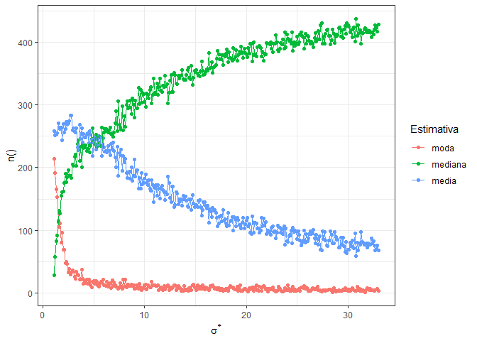
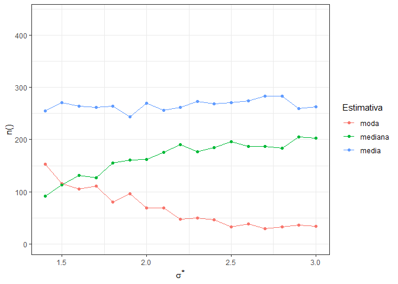

```{r setup, include=FALSE}
knitr::opts_chunk$set(echo = FALSE, dev = "png", dpi = 1200, out.width = "70%", fig.pos = "H",
                      fig.path = "images/", fig.align = "center", warning = FALSE)
type <- knitr::opts_knit$get("rmarkdown.pandoc.to")
options(digits = 10)
library(appraiseR)
library(mosaic)
trellis.par.set(theme=theme.mosaic()) # change default color scheme for lattice
library(ggplot2)
theme_set(theme_bw())
library(scales)
library(readxl)
library(knitr)
library(kableExtra)
library(pander)
library(car)
library(reshape2)
library(quantreg)
library(stargazer)
library(latex2exp)
```

```{r functions}
brformat <- function(x, decimal.mark = ",", big.mark = ".", digits = 2, nsmall = 2, scientific = FALSE, ...) {
  format(x, decimal.mark = decimal.mark, big.mark = big.mark, digits = digits, 
         nsmall = nsmall, scientific = scientific, ...)
}
br <- function(...) {
  function(x) brformat(x, ...)
}
reais <- function(prefix = "R$", ...) {
  function(x) paste(prefix, brformat(x, ...), sep = "")
}
porcento <- function (x) {
    if (length(x) == 0) 
        return(character())
    x <- plyr::round_any(x, scales:::precision(x)/100)
    paste0(x * 100, "\\%")
}
gg_color_hue <- function(n) {
  hues = seq(15, 375, length = n + 1)
  hcl(h = hues, l = 65, c = 100)[1:n]
}
reciprocal_squared_trans <- function() scales::trans_new("reciprocal_squared", function(x) x^(-2), function(x) x^(-.5))
```

# INTRODUÇÃO

Existe na área da avaliação de imóveis uma discussão frequente e a nosso ver indesejável a respeito da estimativa de tendência central adotada para a predição de valores quando da utilização de modelos lineares log-normais, isto é, modelos em que a variável resposta aparece transformada pela função logaritmo natural.

Como será visto oportunamente, quando um modelo linear log-normal for homocedástico ($\sigma=cte$) e estiver razoavelmente bem ajustado, com um baixo erro-padrão, a adoção de qualquer estimativa de tendência central, moda, média ou mediana, resultará em valores praticamente equivalentes com variação dentro da precisão da área de avaliações imobiliárias. No entanto, na presença de grande dispersão dos dados, o valor do erro-padrão da regressão linear pode se tornar relativamente alto e a diferença entre as avaliação por uma ou outra medida de tendência central pode tornar-se relevante, levando a uma situação altamente indesejável: um imóvel poderá ser avaliado por dois avaliadores independentes com uma diferença significativa entre os valores encontrados. Tendo em vista que a NBR14.653-02 [-@NBR1465302] se omite a este respeito, as duas avaliações serão válidas, porém com valores altamente discrepantes.

Pretende-se com este artigo dar a este problema uma abordagem formal, com o intuito de sugerir uma padronização das avaliações, sem no entanto especificar qual medida de tendência central é a correta, haja vista que todas elas tem seus prós e contras e nenhuma delas pode ser dita melhor do que a outra.

# DESENVOLVIMENTO E FUNDAMENTAÇÃO

> Major Point 1: When we talk about the relationship of one variable to one or more others, we are referring to the regression function, which expresses the mean of the first variable as a function of the others. The key word here is *mean*! [@matloff2009, 386, grifo do autor]

## Valor Esperado

Segundo @bennett, a **esperança matemática** ou **valor esperado ** de uma variável aleatória é a soma do produto de cada probabilidade de saída da experiência pelo seu respectivo valor. Isto é, representa o valor médio 'esperado' de uma experiência se ela for repetida muitas vezes. Matematicamente, a Esperança de uma variável aleatória $X$ é representada pelo símbolo $\mathbb{E}(X)$

Segundo Matloff [-@matloff2009, 43], o valor esperado tem um papel central em probabilidade e estatística. A definição mais ampla de valor esperado de uma variável aleatória $X$, válida tanto para variáveis discretas como contínuas, é:

$$\lim_{n \to \infty} = \frac{X_1 + \ldots + X_n}{n}$$

### Cômputo do Valor Esperado de uma variável aleatória discreta

Segundo Matloff [-@matloff2009, 44], o valor esperado de uma variável aleatória $X$ que assume valores definidos no conjunto $A$ é:

$$\mathbb{E}(X) = \sum_{c \in A}c\mathbb{P}(X=c)$$

onde $\mathbb{P(X = c)}$ representa a função probabilidade da variável aleatória $X$ assumir o valor $c$.

### Cômputo do Valor Esperado de uma variável aleatória contínua

O Valor Esperado de uma variável aleatória contínua $W$ pode ser escrito da seguinte forma [@matloff2009, 128]

$$\mathbb{E}(W) = \int_{-\infty}^{\infty}tf_W(t)dt$$

onde $f_W(t)$ é a função densidade de probabilidade de $t$, para todo $t$ onde a função $f_W(t)$ esteja definida.

### Propriedades do Valor Esperado

Seja $a$ um escalar e $U$ uma variável aleatória [@matloff2017, 47]:

$$\mathbb{E}(aU) = a\mathbb{E}(U)$$

Sejam $a$ e $b$ dois escalares e $U$ e $V$ duas variáveis aleatórias, não necessariamente independentes, então [@matloff2017, 47]:

$$\mathbb{E}(aU + bV) = a\mathbb{E}(U) + bE(V)$$

Finalmente, sejam $U$ e $V$ duas variáveis aleatórias *independentes*:

$$\mathbb{E}(UV) = \mathbb{E}(U)\mathbb{E}(V)$$

Porém, se $U$ e $V$ não forem independentes, esta propriedade falha (covariância).

### Lei da expectativa total

Segundo Matloff [-@matloff2009, 339], a lei da expectativa total pode ser expressa como abaixo:

$$\mathbb{E}(Y) = \mathbb{E}[\mathbb{E}(Y|W)]$$

### Lei da Variância total

Outra relação importante é expressa pela lei da Variância Total que, de acordo com Matloff [-@matloff2009, 345] estabelece que:

$$\text{Var}(Y) = \mathbb{E}[\text{Var}(Y|W)] + \text{Var}[\mathbb{E}(Y|W)]$$

## Desigualdade de Jensen

Segundo Matloff [-@matloff2017], se $\varphi(x)$ é uma função convexa, então a desiguldade de Jensen se exprime na seguinte desigualdade:

$\varphi \left(\mathbb{E} [X]\right)\leq \mathbb{E} \left[\varphi (X)\right].$

Como pode-se demonstrar, a função $e^x$ é uma função convexa, pois possui derivada segunda sempre maior que zero (${f}''=e^x>0$).

### Erro médio quadrático (MSE)

Seja $\pi$ o valor de uma estimativa. Então o seu erro médio quadrático (MSE) é dado por:

$$\text{MSE} = \int(y - \pi)f(y)dy\\
= \mathbb{E}[(y-\pi)^2]\\
= \mathbb{E}(y^2)-2\pi \mathbb{E}(y)+\pi^2$$

Para encontrar o valor mínimo do erro médio quadrático (MSE) quando $\pi$ varia, faz-se:

$$\frac{d(\mathbb{E}(y^2)-2\pi \mathbb{E}(y)+\pi^2)}{d\pi} = 0\\
\therefore \pi = \mathbb{E}(y)$$

Ou seja, a estimativa pelo valor esperado é a estimativa que minimiza e erro médio quadrático.


### Valor Esperado condicional

O valor esperado de uma variável aleatória $Y$ estatisticamente relacionada com outra outra variável aleatória $X$ é [@wasserman, 77]:

$$\mathbb{E}(Y|X = t) = \int{t} f_{Y|X}(Y|X = t)dt$$

## Estimadores

> Earlier, we often referred to certain estimators as being “natural.” For example, if we are estimating a population mean, an obvious choice of estimator would be the sample mean. But in many applications, it is less clear what a “natural” estimate for a population quantity of interest would be. We will present general methods for estimation in this section. We will also discuss advanced methods of inference [@matloff2009, 303].

A definição de um *estimador* para um parâmetro ou uma variável $\theta$ é uma função $\hat{\theta}(X)$, que mapeia o espaço amostral para um conjunto de estimativas amostrais, em que $X$ é uma variável aleatória dos dados observados. É usual denotar uma estimativa em um determinado ponto $x \in X$ por $\hat{\theta}(X = x)$ ou, mais simplesmente, $\hat{\theta}(x)$.

### Propriedades de um estimador

Nesta seção adota-se que $\hat{\theta}$ é um estimador da variável aleatória $\theta$.

#### Erro

$$e(x) = \hat{\theta}(x) - \theta$$

#### Desvio

$$d(x) = \hat{\theta}(x) - \mathbb{E}(\hat{\theta}(X))$$
onde $\mathbb{E}(\hat{\theta}(X))$ é o Valor Esperado do estimador.

#### Variância

A variância de um estimador $\theta$ é [@matloff2009, 52]:

$$\text{Var}(\hat{\theta}) = \mathbb{E}[(\hat{\theta} - \mathbb{E}[\hat{\theta}])^2]$$

#### Coeficiente de Variação

O coeficiente de variação de um estimador é uma medida adimensional que compara o desvio-padrão de uma variável ou estimador $\theta$ à sua média, conforme abaixo [@matloff2009, 56]:

$$CV = \frac{\sqrt{\text{Var}(\hat{\theta})}}{E[\hat{\theta}]}$$

#### Viés

O viés de um estimador $\hat{\theta}$ é [@matloff2009, 317]:

$$\text{B}(\hat{\theta}) = \mathbb{E}[\hat{\theta}] - \theta$$

O viés coincide com o valor esperado do erro, pois $\mathbb{E}(\hat{\theta}) - \theta = \mathbb{E}(\hat{\theta}-\theta)$.

Numa regressão linear:

$$\text{B}[\hat{\mu}(x_0)] = \mathbb{E}[\hat{\mu}(x_0)] - \mu(x_0)$$

#### Erro médio quadrático

Segundo Shen e Zhu [-@shen, 553], o erro médio quadrático é uma medida comum da qualidade de um estimador na literatura estatística.

$$\text{MSE} = \mathbb{E}[(\hat{\theta} - \theta)^2]$$

Numa regressão linear, o erro médio quadrático pode ser descrito por:

$$\text{MSE}[\hat{\mu}(x_0)] = \mathbb{E}[\hat{\mu}(x_0) - \mu(x_0)]^2 = \text{Var}[\hat{\mu}(x_0)] + \text{B}^2[\hat{\mu}(x_0)]$$

#### Consistência

$$\lim_{n \rightarrow \infty}\hat{\theta} = \theta$$

### Melhor estimador linear não-viesado ou BLUE

Em estatística, é comum o uso da sigla BLUE (*Best Linear Unbiased Estimator*) para indicar o melhor estimador linear não-viesado.

### Trade-off entre viés e variância

Um dos problemas conhecidos dos modelos de regressão linear ou outros modelos estatísticos em geral é o sobreajustamento (do inglês *overfitting*). Resumidamente, *overfitting* é o ato de ajustar um modelo tão bem ajustado aos dados amostrais, que este se torna incapaz de fazer boas previsões para outros dados que não os do modelo. Segundo Matloff [-@matloff2017, 24], um modelo sobreajustado é um modelo tão elaborado que "capta o ruído ao invés do sinal".

Segundo Matloff [-@matloff2017, 24-26], pelo contrário, um modelo com menor número de variáveis explicativas estará enviesando os seus resultados (no sentido de enviesamento sistêmico, inerente à amostragem, não proposital), e o acréscimo de uma variável independente a este modelo estará assim reduzindo o seu viés.

Por outro lado, de acordo com Matloff [-@matloff2017, 25], quanto maior for o número de variáveis do modelo -- mantido o mesmo número de dados amostrais --, maior será a variabilidade coletiva dos regressores e, assim, maior será a variância dos coeficientes estimados. 

Desta maneira, em modelos mais simples, a redução do viés do mesmo através da adição de um novo regressor compensa o aumento na variabilidade conjunta do modelo, até que este número de regressores atinja um número ótimo, quando a diminuição adicional do viés gerada pela adição de um regressor torna-se tão pequena que não compensa a variabilidade dos coeficientes estimados. Um modelo com variáveis explicativas maior do que este número ótimo estará, portanto, sobreajustado.

Ou seja, existe um *tradeoff* entre viés e variância: para qualquer estimador estatístico [@matloff2017, 25], não se pode reduzir o seu viés sem aumentar a sua variância e vice-versa. Tem-se que conviver sempre com algum viés e tem que se aceitar alguma variância.

Matematicamente, isto decorre do desenvolvimento da expressão do Erro Médio Quadrático (MSE) [@matloff2017, 49]:

$$\mathbb{E}[(\hat{\theta} - \theta)^2] = \mathbb{E}[\hat{\theta} - \mathbb{E}[\hat{\theta}] + \mathbb{E}[\hat{\theta}] - \theta]^2$$

Desenvolvendo a expressão acima, chega-se:

$$\text{MSE} = \mathbb{E}[(\hat{\theta} - \mathbb{E}[\hat{\theta}])^2] + \mathbb{E}[\mathbb{E}[\hat{\theta}] - \theta)^2] + \mathbb{E}[2(\hat{\theta} - \mathbb{E}[\hat{\theta}])(\mathbb{E}[\hat{\theta}] - \theta)]$$
como:

- o termo $\mathbb{E}[(\hat{\theta} - \mathbb{E}[\hat{\theta}])^2]$ é igual à variância do estimador;
- o termo  $\mathbb{E}[\mathbb{E}[\hat{\theta}] - \theta)^2]$ é o quadrado do viés do estimador;
- e, finalmente, o termo $\mathbb{E}[2(\hat{\theta} - \mathbb{E}[\hat{\theta}])(\mathbb{E}[\hat{\theta}] - \theta)]$ é nulo, haja vista que $\mathbb{E}[\hat{\theta} - E(\hat{\theta})] = 0$.

Portanto, matematicamente, temos que: 

$$\text{MSE}(\hat{\theta}) = \text{Var}(\hat{\theta}) + \text{B}^2(\hat{\theta})$$

## A avaliação pela média

### Regressão Linear

#### Definição precisa

Sejam Y e X duas variáveis e $m_{Y;X}(t)$ uma função tal que: 

$$m_{Y;X}(t) = \mathbb{E}(Y|X = t)$$

Chama-se $m_{Y;X}$ de **função de regressão de $Y$ dado $X$** [@matloff2009, 386, grifo do autor]. Em geral, $m_{Y;X}(t)$ é a **média** de $Y$ para todas as unidades da população para as quais $X = t$ [@matloff2009, 386, grifo nosso].

> The word "regression" is an allusion to the famous comment of Sir Francis Galton in the late 1800s regarding "regression toward the mean." This referred to the fact that tall parents tend to have children who are less tall closer to the mean -- with a similar statement for short parents. The predictor variable here might be, say, the father's height F, with the response variable being, say, the son's height S. Galton was saying that $\mathbb{E}(S|F) < F$.

Segundo Matloff [-@matloff2009, 386, grifo do autor], ainda, a função $m_{Y;X}(t)$ é uma função da **população**, ou seja, apenas **estima-se** uma equação de regressão ($\hat{m}_{Y;X}(t)$) à partir de uma amostra da população.

> The function $m_{Y;X}(t)$ is a population entity, so we must estimate it from our sample data. To do this, we have a choice of either assuming that $m_{Y;X}(t)$ takes on some parametric form, or making no such assumption. If we opt for a parametric approach, the most common model is linear [...] [@matloff2009, 389].

Segundo Matloff [-@matloff2009, 394-397], as proposições acima sobre a função $m_{Y;X}$ podem ser generalizadas para outras quantidades de regressores em $X$ e seus termos de interação, tal que:

$$m_{Y;X}(t) = \beta_0 + \beta_1t_1 + \beta_2t_2 + \beta_3t_1t_2 + \beta_4t_1^2$$

Notando que o termo **regressão linear** não necessariamente significa que o gráfico da função de regressão seja uma linha reta ou um plano, mas que se refere a função de regressão ser linear em relação aos seus parâmetros ($\beta_i$).

### Estimação em modelos de regressão paramétricos

Segundo Matloff [-@matloff2009, 389], é possível demonstrar que o mínimo valor da quantidade[^1] $\mathbb{E}[(Y - g(X))^2]$  é obtido, entre todas as outras funções, para $g(X) = m_{Y;X}(X)$. Porém, "se pretendemos minimizar o erro médio absoluto de predição, $\mathbb{E}(|Y - g(X)|)$ , a melhor função seria a mediana $g(Y) = mediana(Y|X)$." [@matloff2009, 389].

Matloff [-@matloff2009] aqui está se referindo à um outro tipo de regressão, chamada de regressão quantílica, mais especificamente, à regressão à mediana, ou seja, ao quantil de 50%.

[^1]: Erro médio quadrático de predição

### A equação de regressão linear

Como será visto nesta seção, a equação de regressão linear $\mu(t)$ é uma *função da população*, que geralmente não nos está acessível, pois se tem acesso a não mais do que uma parte (amostra) desta população em estudo. O que se faz, então, é *estimar* uma equação de regressão $\hat{\mu}(t)$ para que se possa prever os valores reais da variável em análise.

Tem que se levar em conta que a equação de regressão linear não é uma equação determinística, mas probabilística. No dia-a-dia da prática de engenharia de avaliações, assim como em outras áreas, no entanto, a equação de regressão é usualmente escrita simplificadamente, sem o termo de erro $\epsilon$, ou seja, a equação de regressão é escrita como uma equação determinística, da forma $Y = \alpha + X\beta$ ou, exemplificando em termos de variáveis de avaliação de imóveis, $VU = \alpha + A\beta$, onde $VU$ representa o valor unitário dos imóveis e $A$ a sua área.

No entanto, estas equações são uma simplificação da equação de regressão. Na verdade, a equação de regressão $\mu(t)$ é uma função da *população* e pode ser escrita formalmente como abaixo [@matloff2017, 66]:

$$\mu(t) = \beta_0 + \beta_1t_1 + ... + \beta_p t_p$$

Como o termo de erro da equação, ou seja, o erro que seria cometido ao prever $Y$ se a equação de regressão da população fosse efetivamente conhecida, é [@matloff2017, 67]:

$$\epsilon = Y - \mu(t)$$

Então pode-se escrever a equação de regressão de outra maneira, como abaixo [@matloff2017, 67]:

$$Y = \beta_0 + \beta_1t_1 + ... + \beta_p t_p + \epsilon$$

Onde $\epsilon$ é uma variável aleatória supostamente tal que $\mathbb{E}(\epsilon) = 0$ e $\text{Var}(\epsilon) = \sigma^2$, ou simplesmente $\epsilon \sim N(0, \sigma^2)$.

Num modelo onde não há a adoção de qualquer transformação para a variável dependente, verificada a hipótese da normalidade, esta equação de regressão é também a equação de estimação da variável $Y$, ou seja, para uma equação de regressão sem transformação de variáveis, pode-se escrever:

$$\mathbb{E}[Y|X] = \mathbb{E}[\alpha + X\beta] + \mathbb{E}[\epsilon] = \alpha + X\beta$$
Haja vista que o valor esperado para o termo de erro $\epsilon$ é zero.

No entanto, quando a variável dependente $Y$ é transformada, este termo de erro desprezado na equação de regressão acima é de suma importância para o computo do valor esperado da variável original, como será visto neste artigo, pois ele determina a equação de estimação da variável original. Por exemplo, no caso que aqui nos interessa, que é o da transformação logarítmica da variável dependente, tem-se:

$$\ln(Y) = \alpha + X\beta + \epsilon \Leftrightarrow$$
$$Y = \exp(\alpha + X\beta)\exp(\epsilon) \Leftrightarrow$$
$$\mathbb{E}[Y|X] = \mathbb{E}[\exp(\alpha + X\beta)]\mathbb{E}[\exp(\epsilon)|X] \Leftrightarrow$$
$$\mathbb{E}[Y|X] = \exp(\alpha + X\beta)\mathbb{E}[\exp(\epsilon)|X]$$

O fundamental a se perceber aqui é que, quando há transformação da variável dependente, para voltarmos à variável original, tem que se levar em conta o termo de erro, haja vista que uma propriedade do valor esperado é a de que $\mathbb{E}[f(X)] \ne f(\mathbb{E}[X])$, como será visto a seguir. Mais precisamente, para funções convexas, pela desigualdade de Jensen, $f(\mathbb{E}[X]) \leq \mathbb{E}[(f(x)]$. Isto implica que o valor esperado da exponencial do termo de erro que precisa-se estimar é maior do que a exponencial do valor esperado do erro, ou seja, $\mathbb{E}[\exp(\epsilon)|X] \geq \exp(\mathbb{E}[\epsilon|X]) = 1$. 

Desta maneira, não é correto imaginar que a equação de estimação da variável original esteja acessível pela simples retransformação (pela função exponencial) dos coeficientes da equação de regressão logaritmizada. 

Ou seja, a consideração de que os erros aleatórios e com distribuição normal na equação de regressão logaritmizada possam ser diretamente retransformados por um fator de erro multiplicativo igual a 1 é equivocada, já que isto viola a desigualdade de Jensen. O fator de erro multiplicativo, pela desigualdade de Jensen, é maior do que 1.

Desta maneira, não seria correto afirmar que, ao utilizar a avaliação pela média, se esteja violando os princípios clássicos da regressão linear, já que na verdade o que ocorre é justamente o contrário: ao utilizar a média, estamos reafirmando a equação de regressão, que inclui o termo de erro.

@giannakos faz uma crítica à utilização da avaliação pela moda da distribuição lognormal, crítica esta muito bem elaborada e da qual não se discorda no todo. Concorda-se que a moda não é o valor mais provável, contudo, pelo motivo que **o valor mais provável é o Valor Esperado** da variável, ou seja, o seu valor médio, como será visto oportunamente e encontra-se mesmo em @giannakos, que "a média aritmética é o 'valor esperado' da variável". Porém, o mesmo trabalho faz também uma defesa da utilização da estimativa pela mediana desta distribuição, o que não estaria de acordo com o que prevê a teoria.

Mesmo a avaliação pela média da variável lognormal não é exata, haja  vista que inexiste um estimador exato na inferência estatística. O que existe são estimadores com maior ou menor viés, e maior ou menor variância. Na verdade, o que poderia ser afirmado é que, ao avaliar pela média, o avaliador estaria se aproximando melhor da equação de regressão do que ao avaliar pela moda ou pela mediana, haja vista que faz parte da equação de regressão o termo de erro multiplicativo, de valor sabidamente maior do que 1 (pela desigualdade de Jensen).

### O problema da retransformação das variáveis

De acordo com Shen e Zhu [-@shen, 552], modelos lineares lognormais tem muitas aplicações e muitas vezes é de interesse prever a variável resposta ou estimar a média da variável resposta na escala original para um novo conjunto de covariantes.

Segundo Shen e Zhu [-@shen, 552], se $Z = (Z_1,\cdots, Z_n)^T$ é o vetor variável resposta de distribuição lognormal e $x_i = (1, x_{i1}, \cdots, x_{ip})^T$ é o vetor dos covariantes para a observação $i$, um modelo linear lognormal assume a seguinte forma:

$$Y = \ln(Z) = X\beta + \epsilon$$

onde $X = (x_1, \cdots, x_n)^T$, $\beta = (\beta_0, \beta_1, \cdots, \beta_p)^T$, e $\epsilon = (\epsilon_1, \cdots, \epsilon_n)^T$ com $\epsilon_i \sim  N(0, \sigma^2)$ i.i.d.(*identically independently distributed*) [@shen, 552-553].

> Em muitos casos, para um novo conjunto de covariantes $x_0$, pode-se estar interessado em prever a variável resposta em sua escala original:
>
> $$Z_0 = e^{x_o^T\beta + \epsilon_0}$$
>
> ou estimar a média condicional da variável resposta:
>
> $$\mu(x_0)=\mathbb{E}[Z_0|x_o] = e^{x_o^T\beta + \frac{1}{2}\sigma^2}$$

De acordo com Shen e Zhu[-@shen, 553], se $\beta$ e $\sigma^2$ são ambos conhecidos, então é fácil demonstrar que o melhor estimador de $Z_0$ é de fato $\mu(x_0)$. Contudo, na prática, ambos $\beta$ e $\sigma^2$ são desconhecidos e precisam ser estimados para a obtenção de $\mu(x_0)$.

Segundo Shen e Zhu [-@shen, 552], existem na literatura diversos estimadores baseados em diversos métodos inferenciais, como **ML** (*Maximum Likelihood  Estimator*), **REML** (*Restricted ML Estimator*), **UMVU** (*Uniformly Minimum Variance Unbiased Estimator*), além de um estimador **REML** com viés corrigido.

Na prática, estes estimadores pertencem a uma classe de estimadores definida na expressão abaixo:

$$\begin{Bmatrix}
\hat{\mu_c}(x_0):\hat{\mu_c}(x_0) = \exp(x_0^T\hat{\beta} + cRSS/2), c = \frac{1}{n-a}, a<n
\end{Bmatrix}$$

Shen e Zhu[-@shen] então propõem dois novos estimadores baseados na minimização do erro médio quadrático assintótico ($MM$) e do viés assintótico ($MB$).

De maneira que a diferença entre os estimadores supra-citados pode ser resumida ao parâmetro $a$:

$a_{ML} = 0$

$a_{REML} = p + 1$

$a_{MM} = p - 1 - 3nv_0 - 3RSS/(2m)$

$a_{MB} = p + 1 - nv_0 - RSS/(2m)$

#### Estimadores não-paramétricos

De acordo com Duan [-@Duan, 606], o Valor Esperado $\mathbb{E}$ de uma variável resposta $Y$ que tenha sido transformada em valores $\eta$ durante a regressão linear por uma função $g(Y)$ **não-linear** não é igual ao valor da simples retransformação da variável transformada pela sua função inversa $h(\eta) = g^{-1}(Y)$. Em outros termos [@Duan, 606]:

$$\mathbb{E}[Y_0] = \mathbb{E}[h(x_0\beta + \epsilon)] \ne h(x_o\beta)$$

Reparar que o termo de erro faz parte da composição do valor esperado da variável de regressão. Em uma regressão linear clássica, sem transformação, $\mathbb{E}[\epsilon] = 0$, então $\mathbb{E}[Y_0] = \mathbb{E}[x_0\beta]$.

Numa regressão linear logaritmizada, ou seja, uma regressão linear com o logaritmo da variável dependente ($h(\eta) = g^{-1}(\eta) = \exp(\eta)$), para efetuar apropriadamente a retransformação das estimativas de volta a sua escala original, precisa-se ter em conta a desigualdade mencionada na seção \ref{valor-esperado}.

Segundo [@NBERt0246], quando se ajusta o logaritmo natural de uma variável $Y$ contra outra variável $X$ através da seguinte equação de regressão:

$$ln(Y) = \beta_0 + \beta_1X + \epsilon$$

Se o erro $\epsilon$ é normalmente distribuído, com média zero e desvio padrão $\sigma^2$, ou seja, se $\epsilon \sim N(0, \sigma^2)$, então [@NBERt0246, 6; @Duan, 606]:

$$\mathbb{E}[Y|X] = e^{\beta_0 + \beta_1X} \cdot \mathbb{E}[e^\epsilon] \ne e^{\beta_0 + \beta_1X}$$

Embora o valor esperado dos resíduos $\epsilon$ seja igual a zero, ele está submetido a uma transformação não linear, de maneira que não se pode afirmar que $\mathbb{E}[e^\epsilon] = 1$ (como foi visto na seção \ref{desigualdade-de-jensen}, $\mathbb{E}[\exp(x)] > \exp[\mathbb{E}(x)]$). Desta maneira, o estimador abaixo, chamado em [@shen, 554] de *naive back-transform estimator*, ou simplesmente **BT** não é consistente e é enviesado, tendo viés multiplicativo de valor assintótico igual a $e^{-\sigma^2/2}$:

$$\mathbb{E}[Y|X] = e^{\beta_0 + \beta_1X}$$

Segundo [@shen, 554], ainda, o valor de $e^{-\sigma^2/2}$ é sempre menor do que 1[@shen, 554].

> As a result, the BT estimator underestimates $\mu(x_0)$, and the bias is large when $\sigma^2$ is large. In our study, it appears that the BT estimator performs much worse than the other estimators[...]Actually, the BT estimator is more suitable for estimating the median of Z0, which is $\exp(x_0^T\beta)$ in this case.

Porém se o termo de erro $\epsilon$ é normalmente distribuído $N(0,\sigma^2)$, então um estimador não-enviesado para o valor esperado $\mathbb{E}[Y]$, de acordo com @Duan, assume a forma vista na equação abaixo[@Duan, 606; @NBERt0246, 2 e 6]:

$$\mathbb{E}[Y] = e^{\beta_0 + \beta_1X} \cdot e^{\frac{1}{2}\sigma^2}$$

Cabe salientar, segundo [@NBERt0246, 6], que se o termo de erro não for i.i.d (independente e identicamente distribuído), mas for homoscedástico, então:

$$\mathbb{E}[Y|X]=s \times e^{X_0\beta}$$
onde $s = \mathbb{E}[e^\epsilon]$.

De qualquer maneira, o valor esperado de $Y$ é proporcional à exponencial da previsão na escala log.

@Duan apresenta então um estimador não-paramétrico (*smearing estimate*), independente da função de transformação $h(\eta)$ e da distribuição dos erros $F(\epsilon)$, tal que:

$$\hat{\mathbb{E}}[Y_0] = \int h(x_0\hat{\beta} + \epsilon)d\hat{F}_n(\epsilon) = \frac{1}{n}\sum_{i = 1}^{n}h(x_0\hat{\beta}+\hat{\epsilon_i})$$

## Considerações sobre os valores de $\sigma^*$

Segundo Limpert [@limpert, 346], distribuições lognormais de diversas ciências tem, em geral, valores de $s^*$ (o desvio padrão da amostra, na escala original) variando de 1,1 a 33 (na escala logarítmica, entre `r format(round(log(1.1), 3), decimal.mark = ",")` e `r format(round(log(33), 3), decimal.mark = ",")`), sendo que o mais comum é que estes valores estejam entre 1,4 e 3 (`r format(round(log(1.4), 3), decimal.mark = ",")` $\leq s \leq$ `r format(round(log(3), 3), decimal.mark = ",")` na escala logarítmica). 

## Modelos Heteroscedásticos

Modelos heteroscedásticos não são raros, especialmente no caso de variáveis envolvendo valores em moeda, sendo muito comum em modelos econométricos. Em sua essência, são heteroscedásticos aqueles modelos lineares cujo termo de erro não pode ser considerado totalmente independente, ou seja, existe alguma função (linear ou não), tal que $\mathbb{E}[e^\epsilon] = f(x)$, de modo que:

$$\ln(\mathbb{E}[Y|X]) = X\beta + \ln(f(x))$$

É desnecessário dizer que, para estes modelos o estimador para a média é diferente de $\mathbb{E}[Y] = e^{\beta_0 + \beta_1X} \cdot e^{\frac{1}{2}\sigma^2}$, haja vista que $\sigma^2$ não é mais um escalar, mas uma função.

Existem diversas maneiras de se contornar este problema. Por exemplo, através da eliminação do viés através da utilização de uma função que modele a variância $\sigma^2(X)$, ou através do estimador sanduíche[^3].

[^3]: ver [link](https://matloff.wordpress.com/2015/09/18/can-you-say-heteroscedasticity-3-times-fast/)

Cabe ainda salientar que, para os modelos heteroscedásticos, não apenas os erros estão comprometidos, mas também os intervalos de confiança.

## Validação Cruzada 

Em inferência estatística é fundamental que os erros sejam avaliados não apenas sobre o conjunto amostral dos dados do modelo, mas também que o modelo encontrado efetue boas previsões para novos conjuntos de dados, afinal, na engenharia de avaliações, o intuito final é estimar o valor de um *novo* imóvel, baseado num conjunto amostra de dados semelhantes ao avaliando.

Validação Cruzada ou *cross-validation* é uma técnica estatística que pode ser utilizada de diversas maneiras e consiste em dividir um conjunto de dados em duas ou mais partições distintas, chamados de partição ou partições de treino (*training set*) e partição de teste(*test set*), utilizadas para o ajuste do modelo e para a previsão da variável dependente, respectivamente. Os dados previstos na partição de teste são então comparados aos valores observados.

Neste artigo será utilizada a validação-cruzada utilizando o procedimento chamado de *delete-one procedure*, ou *leave-one-out*, em que se retira apenas um dado do conjunto de dados, ajusta-se um modelo e então utiliza-se este modelo para prever o valor da variável dependente para o dado retirado [@shen, 564].

Para cada observação então calcula-se o seu erro quadrático ($(Y_i - \hat{Y}_i)^2$), utilizado para o cálculo da estatística RMSPE (erro de previsão médio quadrático, ou *root mean squared prediction error*) conforme expressão a seguir [@shen, 564]:

$$\text{RMSPE} = \left ( \frac{1}{n}\sum_{i = 1}^{n}(Y_i - \hat{Y}_i)^2 \right ) ^{1/2}$$

# ESTUDO DE CASO

Com o fim de averiguar qual estimador melhor se adequa ao procedimento de retransformação de variáveis, aplicar-se-á um comparativo entre os estimadores média, moda e mediana, através do uso da estatística RMSPE.

## Procedimento com dados randômicos

Foram realizadas diversas simulações com dados randomicamente gerados através do software **R** versão `r paste(R.version$major, R.version$minor, sep = ".")`.

Conforme mencionado na seção \ref{consideracoes-sobre-os-valores-de-sigma}, os valores de $s^*$ já encontrados nas aplicações práticas encontram-se entre 1,1 e 33 (`r format(round(log(1.1), 3), decimal.mark = ",")` e `r format(round(log(33), 3), decimal.mark = ",")`), sendo mais comum  que estejam entre 1,4 e 3 (`r format(round(log(1.4), 3), decimal.mark = ",")` $\leq s \leq$ `r format(round(log(3), 3), decimal.mark = ",")`). As simulações, portanto, serão feitas para valores de $s^*$ dentro destes limites.

Nas figuras \ref{fig:log} e \ref{fig:original} podem ser vistos graficamente os modelos para alguns valores de $\sigma^*$, na escala logarítimica e na escala original.

Para estes modelos, cujas principais estatísticas estão ilustradas na tabela \ref{tab:fits}, pode ser visto na figura \ref{fig:estimativas}, como variam as estimativas realizadas com cada um deles através de 3 estimadores: moda, média e mediana. Observa-se que, como os modelos são semelhantes, *i.e.* apresentam praticamente os mesmos coeficientes, diferindo apenas no erro-padrão, o valor da mediana permanece praticamente inalterado, enquanto moda e média, que para baixos valores de $\sigma^*$ praticamente coincidem com a estimativa da mediana, se afastam progressivamente desta quando os valores de $\sigma^*$ aumentam.

```{r}
set.seed(1)
x <- runif(200, 10, 100)
y <- exp(x/8 + rnorm(200, 0, log(1.1))) 
data <- data.frame(x, y)
fit <- lm(log(y) ~ x)
s <- summary(fit)
y1 <- exp(x/8 + rnorm(200, 0, log(1.25))) 
fit1 <- lm(log(y1) ~ x)
s1 <- summary(fit1)
data1 <- data.frame(x, y1)
y2 <- exp(x/8 + rnorm(200, 0, log(1.5)))
data2 <- data.frame(x, y2)
fit2 <- lm(log(y2) ~ x)
s2 <- summary(fit2)
y3 <- exp(x/8 + rnorm(200, 0, log(2))) 
fit3 <- lm(log(y3) ~ x)
s3 <- summary(fit3)
data3 <- data.frame(x, y3)
y4 <- exp(x/8 + rnorm(200, 0, log(3))) 
fit4 <- lm(log(y4) ~ x)
s4 <- summary(fit4)
data4 <- data.frame(x, y4)
```

```{r}
# Usando o primeiro modelo
p <- predict(fit, newdata = data.frame(x = 50))
p_moda <- exp(p - s$sigma^2)
p_mediana <- exp(p)
p_media <- exp(p + s$sigma^2/2)
# Usando o segundo modelo
p1 <- predict(fit1, newdata = data.frame(x = 50))
p1_moda <- exp(p1 - s1$sigma^2)
p1_mediana <- exp(p1)
p1_media <- exp(p1 + s1$sigma^2/2)
# Usando o terceiro modelo
p2 <- predict(fit2, newdata = data.frame(x = 50))
p2_moda <- exp(p2 - s2$sigma^2)
p2_mediana <- exp(p2)
p2_media <- exp(p2 + s2$sigma^2/2)
# Usando o quarto modelo
p3 <- predict(fit3, newdata = data.frame(x = 50))
p3_moda <- exp(p3 - s3$sigma^2)
p3_mediana <- exp(p3)
p3_media <- exp(p3 + s3$sigma^2/2)
# Usando o quinto modelo
p4 <- predict(fit4, newdata = data.frame(x = 50))
p4_moda <- exp(p4 - s4$sigma^2)
p4_mediana <- exp(p4)
p4_media <- exp(p4 + s4$sigma^2/2)
```


```{r}
df <- data.frame(sd = c(1.1, 1.25, 1.5, 2, 3),
                 moda = c(p_moda, p1_moda, p2_moda, p3_moda, p4_moda),
                 mediana = c(p_mediana, p1_mediana, p2_mediana, p3_mediana, p4_mediana),
                 media = c(p_media, p1_media, p2_media, p3_media, p4_media))
df <- melt(df, id = "sd")
```

```{r}
p <- ggplot(data, aes(x = x, y = y)) + 
  scale_y_continuous(trans = "log", labels = br(nsmall = 0)) +
  geom_point(size = .1, alpha = 0.5) + 
  stat_smooth(method = "lm", level = 0.95, size = .25) +
  ggtitle("", subtitle = TeX("$\\sigma^* = 1,1$"))
p1 <- ggplot(data1, aes(x = x, y = y1)) + 
  scale_y_continuous(trans = "log", labels = br(nsmall = 0)) +
  geom_point(size = .1, alpha = 0.5) + 
  stat_smooth(method = "lm", level = 0.95, size = .25) +
  ggtitle("", subtitle = TeX("$\\sigma^* = 1,25$"))
p2 <- ggplot(data2, aes(x = x, y = y2)) + 
  scale_y_continuous(trans = "log", labels = br(nsmall = 0)) +
  geom_point(size = .1, alpha = 0.5) + 
  stat_smooth(method = "lm", level = 0.95, size = .25) +
  ggtitle("", subtitle = TeX("$\\sigma^* = 1,5$"))
p3 <- ggplot(data3, aes(x = x, y = y3)) + 
  scale_y_continuous(trans = "log", labels = br(nsmall = 0),
                     breaks = c(20, 403, 8103, 162755)) +
  geom_point(size = .1, alpha = 0.5) + 
  stat_smooth(method = "lm", level = 0.95, size = .25) +
  ggtitle("", subtitle = TeX("$\\sigma^* = 2$"))
p4 <- ggplot(data4, aes(x = x, y = y4)) + 
  scale_y_continuous(trans = "log", labels = br(nsmall = 0), 
                     breaks = c(20, 403, 8103, 162755)) +
  geom_point(size = .1, alpha = 0.5) + 
  stat_smooth(method = "lm", level = 0.95, size = .25) +
  ggtitle("", subtitle = TeX("$\\sigma^* = 3$"))
```

```{r log, out.width="100%", fig.cap="Diversas regressões similares, com diferentes valores de erro-padrão (escala logarítmica. Fonte: Autores."}
cowplot::plot_grid(p, p1, p2, p3, p4, align = "hv", 
                   labels = "auto", label_size = 12)
```

```{r original, out.width="100%", fig.cap="Diversas regressões similares, com diferentes valores de erro-padrão (escala original). Fonte: Autores."}
cowplot::plot_grid(p + coord_trans(y = scales::exp_trans()), 
                   p1 + coord_trans(y = scales::exp_trans()), 
                   p2 + coord_trans(y = scales::exp_trans()), 
                   p3 + coord_trans(y = scales::exp_trans()), 
                   p4 + coord_trans(y = scales::exp_trans()),
                   labels = "auto", label_size = 12)
```


```{r estimativas, fig.cap="Impacto do erro-padrão no cálculo da estimativas segundo as diversas medidas de tendência central. Fonte: Autores.", out.width="60%"}
ggplot(df, aes(x = sd, y = value, color = variable)) + 
  geom_point() + 
  geom_line() + 
  xlab(TeX("$\\sigma^*$")) +
  ylab(TeX("$\\hat{Y}$"))
```

```{r, results='asis'}
stargazer(fit, fit1, fit2, fit3, fit4,
          header = F, type = type, label = "tab:fits",
          title = "Comparação dos diversos modelos gerados, com diferentes erro-padrão",
          digit.separator = ".", digits = 3, decimal.mark = ",", initial.zero = T,
          omit.stat = "f")
```


Foram gerados, então, randomicamente, 200 dados uniformes variando de 10 a 100 para variável independente e 200 dados lognormais para a variável dependente, estatisticamente correlacionados com a variável independente, tal que o erro padrão $\hat{\sigma}^*$ da equação de regressão $ln(y) \sim x$ varie de 1,1 a 33, em passos de 0,1. Para cada valor de $\hat{\sigma}^*$, foram gerados 500 modelos de regressão linear, utilizando 70\% (140) dos dados escolhidos randomicamente (partição de treinamento), efetuando-se as estimativas sobre os 30\%  (60) dos dados restantes (partição de testes). Para os dados da partição de testes, então, foi calculado o RMSPE para os diversos estimadores (média, moda e mediana).

Devido à aleatoriedade da escolha das partições de testes e treinamento, o menor RMSPE pode estar tanto na moda, como na média ou na mediana, dependendo dos dados escolhidos.

Nas figuras 4 e 5, podem ser vistos o número de vezes em que cada uma das estimativas obteve o menor valor de RMSE entre elas, quando varia o erro-padrão da regressão.

Percebe-se claramente na figura 4 que, para baixos valores de erro-padrão, a média predomina como melhor estimativa. À partir de um valor de erro-padrão aproximadamente igual a 5, a mediana torna-se a estimativa com menor RMSE.

Na figura 5, pode-se ver os resultados das simulações, porém apenas para a faixa de valores dita mais comum ($1,4 \leq \sigma^* \leq(3)$), onde percebe-se que sempre a média tem um melhor comportamento.


{width=65%}

{width=65%}

Nesta faixa, pelas simulações, a estimação pela média obteve maior eficiência do que a estimação pela mediana ou pela moda, ou seja, os valores de RMSE para as estimativas pela média são menores do que os estimados pela moda ou mediana em aproximadamente 50 a 60\% dos casos (250/300 em 500).

\newpage

## Regressão com dados reais de mercado

### Dados

Neste estudo será comparada a precisão de diversos modelos estatísticos sobre dados de mercado reais disponíveis em Hochheim [-@hochheim, 21-22] e com dados gerados aleatoriamente. A distribuição da variável dependente (valor), pode ser vista na figura \ref{fig:hist}.

```{r}
dados <- na.omit(centro_2015@data)
dados$padrao <- as.numeric(dados$padrao)
outliers <- c(31, 39)
x <- exp(mean(log(dados$valor)))
s <- exp(sqrt(sum(log(dados$valor/x)^2)/length(dados$valor)))
```

Pode-se mostrar que os dados de Hochheim [-@hochheim, 21-22] utilizados no estudo de caso deste artigo, de acordo com a estimação **MLE** (*Maximum Likelihood Estimator*), possuem média $\bar{x}^* =$ `r format(round(x, 2), decimal.mark = ",", big.mark = ".")` e  desvio-padrão $s^* =$ `r format(round(s, 3), decimal.mark = ",")`, calculadas conforme Limpert [-@limpert, 345] e o modelo encontrado na mesma referência possui erro-padrão $\hat{\sigma} = 0,136$. Para valores de $\hat{\sigma}$ tão baixos como este, as estimativas efetuadas com a média, moda ou mediana são praticamente idênticas, com variação de mais ou menos 1 ou 2\% entre as estimativas. Porém, para valores apenas um pouco mais altos de $\hat{\sigma}$, verifica-se que a tendência é que a diferença entre as estimativas realizadas por estes diferentes estimadores se tornem relevantes, o que será mostrado oportunamente.


```{r hist, fig.keep='last', fig.cap="Histograma da variável \\texttt{valor} e sua distribuição teórica (lognormal). Fonte: Autores."}
histogram(dados$valor)
plotDist("lnorm", 
         meanlog = log(x),
         sdlog = log(s), 
         add = TRUE)
```


### Cálculo do RMSPE

Para o cálculo do RMSPE foi utilizado como referência o modelo proposto por Hochheim [-@hochheim, 29], ou seja, foram utilizadas as mesmas transformações de variáveis utilizadas no modelo proposto. Os valores dos $\hat{\beta_i}$ são calculados a cada passo.

```{r}
p <- vector(mode = "numeric", length = dim(dados)[1])
spe <- vector(mode = "numeric", length = dim(dados)[1])
for (i in seq_len(dim(dados)[1])) {
  df <- dados[-c(outliers, i), ]
  fit <- lm(log(valor) ~ area_total + quartos + suites + garagens + log(dist_b_mar) + I(padrao^-1), data = df)
  s <- summary(fit)
  p[i] <- exp(predict(fit, newdata = dados[i, ]))
  spe[i] <- (pull(dados[i, "valor"]) - p[i])^2
}
RMSPE <- sqrt(mean(spe))
```

```{r}
p1 <- vector(mode = "numeric", length = dim(dados)[1])
spe1 <- vector(mode = "numeric", length = dim(dados)[1])
for (i in seq_len(dim(dados)[1])) {
  df <- dados[-c(outliers, i), ]
  fit1 <- lm(log(valor) ~ area_total + quartos + suites + garagens + 
               log(dist_b_mar) + I(padrao^-1), data = df)
  s1 <- summary(fit)
  p1[i] <- exp(predict(fit1, newdata = dados[i, ]) + .5*s1$sigma^2)
  spe1[i] <- (pull(dados[i, "valor"]) - p1[i])^2
}
RMSPE1 <- sqrt(mean(spe1))
```

```{r}
p2 <- vector(mode = "numeric", length = dim(dados)[1])
spe2 <- vector(mode = "numeric", length = dim(dados)[1])
for (i in seq_len(dim(dados)[1])) {
  df <- dados[-c(outliers, i), ]
  fit2 <- lm(log(valor) ~ area_total + quartos + suites + garagens + 
               log(dist_b_mar) + I(padrao^-1), data = df)
  s2 <- summary(fit)
  p2[i] <- exp(predict(fit2, newdata = dados[i, ]) - s2$sigma^2)
  spe2[i] <- (pull(dados[i, "valor"]) - p2[i])^2
}
RMSPE2 <- sqrt(mean(spe2))
```

Os valores encontrados para o erro de predição médio quadrático para cada estimador foram: **R\$`r brformat(RMSPE1, digits = 0)`** para a média, **R\$`r brformat(RMSPE, digits = 0)`** para a mediana e **R\$`r brformat(RMSPE2, digits = 0)`** para a moda.

Como esperado, o RMSPE foi menor para a média, e maior para a moda. O que comprova a teoria, já que o *naive estimator* é enviesado com viés conhecido de $-\sigma^2/2$, logo a moda possui viés de $-1,5\sigma^2$. Os valores ajustados com as estimativas da moda, média e mediana podem ser vistos na tabela online[^2].

[^2]: https://github.com/lfpdroubi/moda-media-mediana/blob/master/tabela.xls

### Impacto do erro-padrão

Na tabela 2 são mostrados, analogamente ao que foi feito no exemplo anterior com dados randômicos, os valores calculados das estimativas pela moda, média e mediana para o bem avaliando (ver @hochheim, p.22) pelo modelo de Hochheim [-@hochheim, 29], com o erro-padrão do modelo (0,136) e para outros valores de erro-padrão.

Tabela 2: Estimativas Moda, Média e Mediana para diferentes valores de erro-padrão

|  Estimativa / Erro-Padrão | 0,136      |0,25       | 0,5         | 0,75       |
|:--------------------------|-----------:|----------:|------------:|-----------:|
| Moda                      | 944.013,56 |903.396,57 |748.942,06   |547.937,72  |
| Dif. em relação à Mediana | -1,84%     | -6,06%    | -22,12%     | -43,02%    |
| Mediana                   | 961.660,64 |961.660,64 |961.660,64   |961.660,64  |
| Média                     | 970.607,51 |992.187,03 |1.089.704,27 |1.273.993,36|
| Dif. em relação à Mediana | +0,93%     | +3,17%    | +13,31%     | +32,48%    |

Pela análise dos valores da tabela, percebe-se que, para diversos modelos com iguais coeficientes $\hat{\beta_i}$, mas com diferentes erro-padrão, a única estimativa que se mantém constante para todos os modelos é a mediana. Para as outras estimativas, os valores tornam-se rapidamente muito diferentes.

# CONCLUSÕES E RECOMENDAÇÕES

Conforme se discute em @dist_lognormal, a transformação da variável dependente na regressão linear tem por objetivo tentar remover a heteroscedasticidade do modelo, o que acarreta em distorções, haja vista que a regressão assim obtida é valida apenas para a variável transformada, já que na escala original esta equação de regressão difere da equação da escala logarítmica, pela desigualdade de Jensen.

Conforme apresentado em @pressupostos_classicos, existem outras maneiras de se contornar o problema da heteroscedasticade, através do uso de métodos que computem erros heteroscedásticos-consistentes, como o método de Eicker-White, ou através da utilização de regressão ponderada.

Recomenda-se, desta maneira, que seja evitada a utilização de transformações nos modelos de regressão, sempre que possível e, em caso de heteroscedasticidade, utilizar os métodos supra-citados. No entanto, se a transformação da variável dependente for necessária, recomenda-se especial atenção à heteroscedasticidade, fazendo uso de métodos como o de Box-Cox para encontrar a transformação que melhor estabiliza a variância do modelo.

Em caso de transformação da variável dependente pela função logarítmo natural, deve ser escolhida a estimativa adequada. Como foi visto na seção \ref{regressao-linear}, o método clássico de regressão linear é uma minimização do erro médio quadrático de predição e a função de regressão $\hat{m}_{Y;X}$ é uma equação para a *média* da população $Y$ dado $X$, seja ela uma função de outra variável ou não. 

Ora, claro está, de acordo com todos os trabalhos citados, inclusive @giannakos, que o valor esperado da variável é a média. A regressão linear com o método dos mínimos quadrados é uma regressão para a média. Isto posto, como então avaliar o valor da variável original? Porque na área de avaliações não há interesse na previsão da variável $W = \ln(Y)$, mas sim na variável $Y$, ou seja, existe interesse nos valores previstos para a variável original, não nos valores da variável transformada. Está claro que deve-se proceder a retransformação da variável $W$ na  variável original, mas para isso, qual estimativa utilizar?

Conforme mostrado, as três estimativas são válidas. Para a determinação do valor de um imóvel em específico, no entanto, entende-se que não seria ideal que se utilizasse a avaliação pela média ou pela moda da variável lognormal, haja vista que, conforme demonstrado, os seus valores podem variar bastante de um modelo para outro, a depender do erro-padrão. 

Assim, poder-se-ia imaginar hipoteticamente que, dois avaliadores, de maneira independente, ao estudar um determinado mercado para a avaliação de um imóvel cheguem a modelos de regressão semelhantes, com transformação da variável dependente pela função logarítmo natural, obtendo-se valores semelhantes dos coeficientes de regressão. Porém, a depender de suas amostras, um dos modelos pode ter um erro-padrão diferente do outro. Estes dois avaliadores, ao avaliarem o imóvel em pauta pela mediana da variável lognormal, chegariam ao mesmo resultado. Porém, se os mesmos adotarem a média ou a moda da variável lognormal, estes valores podem ser significativamente diferentes. A situação ainda se agravaria caso um dos avaliadores adotasse a avaliação pela média e o outro a avaliação pela moda.

Em vários campos, a mediana tem sido adotada como melhor estimativa, por sua propriedade de estar menos vulnerável a presença de *outliers*, o que não ocorre com a média.

<!-- # ANEXO {-} -->

<!-- ```{r tabela} -->
<!-- tabela <- data.frame(Y = dados$valor, Média = p1, Mediana = p, Moda = p2, `Mediana^1` = p3) -->
<!-- rownames(tabela) <- paste("AP_", 1:50, sep = "") -->
<!-- kable(tabela, -->
<!--       format = ifelse(type == "html", "markdown", type), -->
<!--       caption = "Valores ajustados para os dados pelos estimadores", -->
<!--       digits = 0, format.args = list(big.mark = "."),  -->
<!--       booktabs = TRUE, longtable = TRUE, -->
<!--       row.names = TRUE) %>% -->
<!--   kable_styling(latex_options = "striped",  -->
<!--                             bootstrap_options = "striped") %>%  -->
<!--   add_header_above(c(" " = 1, "Dados" = 1, "Regressão Linear" = 3, "Regressão Quantílica" = 1)) %>% -->
<!--   footnote(number = "Estimada pela regressão à mediana.") -->
<!-- ``` -->


# REFERÊNCIAS {-}