# INTRODUÇÃO

Segundo Limpert [@limpert, 346], distribuições lognormais de diversas ciências tem, em geral, valores de $s^*$ variando de 1,1 a 33 (na escala natural, entre 0,095 e 3,497), sendo que o mais comum é que estes valores estejam entre 1,4 e 3 (0,336 $\leq s \leq$ 1,099). 

Na Engenharia de Avaliações, temos: 


```r
data(centro_2015)
dados <- centro_2015@data
dados <- dados[complete.cases(dados), ]
x <- exp(mean(log(dados$valor)))
s <-exp(sqrt(sum(log(dados$valor/x)^2)/length(dados$valor)))
f1 <- fitdist(dados$valor, "lnorm", method = "mle")
```

* Hochheim [@hochheim, 21]: $s^* =$ 1,851.

# EXEMPLO 1

## GERAÇÃO DE DADOS RANDÔMICOS


```r
set.seed(1)
x <- seq(1, 100, 0.5)
y <- exp(x/25 + rnorm(199, sd = .1)) 
```

## GRÁFICOS


```r
plot(log(y) ~ x)
```

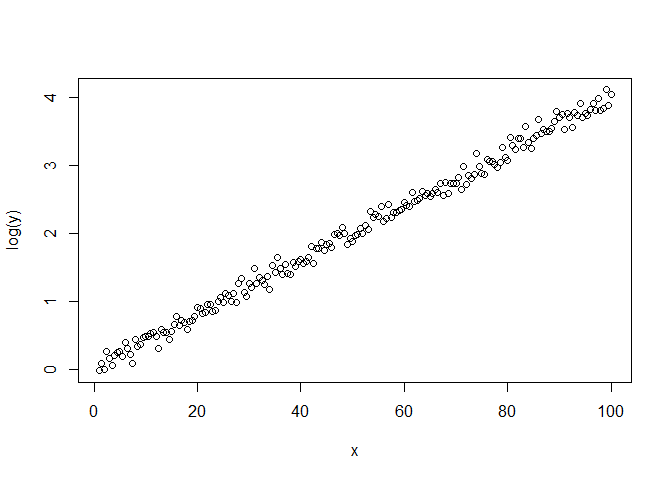<!-- -->


```r
histogram(y)
plotDist("lnorm", 
         meanlog = mean(log(y), na.rm = TRUE),
         sdlog = sd(log(y), na.rm = TRUE), 
         add = TRUE)
```

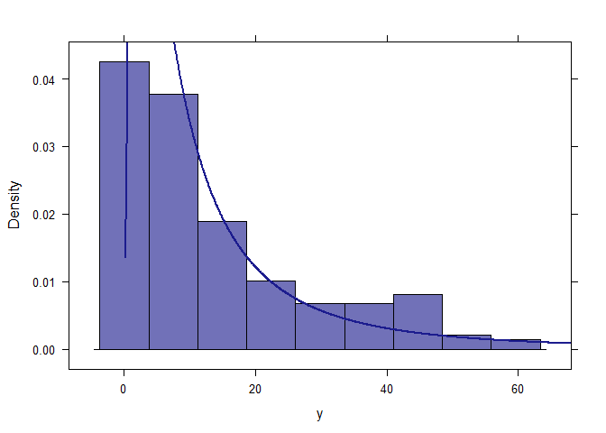<!-- -->


## MODELO


```r
fit <- lm(log(y) ~ x)
s <- summary(fit)
s
```

```
## 
## Call:
## lm(formula = log(y) ~ x)
## 
## Residuals:
##      Min       1Q   Median       3Q      Max 
## -0.23390 -0.06364 -0.00840  0.05575  0.23419 
## 
## Coefficients:
##              Estimate Std. Error t value Pr(>|t|)    
## (Intercept) 0.0139382  0.0133564   1.044    0.298    
## x           0.0397985  0.0002299 173.114   <2e-16 ***
## ---
## Signif. codes:  0 '***' 0.001 '**' 0.01 '*' 0.05 '.' 0.1 ' ' 1
## 
## Residual standard error: 0.09315 on 197 degrees of freedom
## Multiple R-squared:  0.9935,	Adjusted R-squared:  0.9934 
## F-statistic: 2.997e+04 on 1 and 197 DF,  p-value: < 2.2e-16
```

# EXEMPLO 2

Mantido mesmo vetor x criado anteriormente.

## GERAÇÃO DE DADOS RANDÔMICOS


```r
y1 <- exp(x/25 + rnorm(199, sd = .25)) 
```

## GRÁFICOS


```r
plot(log(y1) ~ x)
```

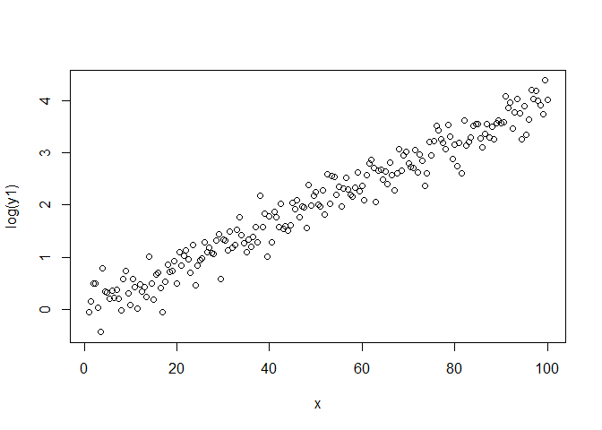<!-- -->


```r
histogram(y1)
plotDist("lnorm", 
         meanlog = mean(log(y1), na.rm = TRUE),
         sdlog = sd(log(y1), na.rm = TRUE), 
         add = TRUE)
```

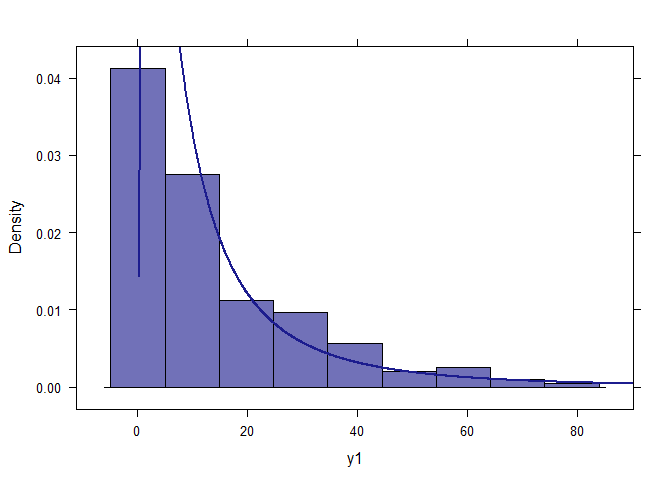<!-- -->

## MODELO


```r
fit1 <- lm(log(y1) ~ x)
s1 <- summary(fit1)
s1
```

```
## 
## Call:
## lm(formula = log(y1) ~ x)
## 
## Residuals:
##      Min       1Q   Median       3Q      Max 
## -0.73214 -0.12672 -0.00943  0.17041  0.65261 
## 
## Coefficients:
##              Estimate Std. Error t value Pr(>|t|)    
## (Intercept) 0.0100938  0.0363167   0.278    0.781    
## x           0.0399891  0.0006251  63.972   <2e-16 ***
## ---
## Signif. codes:  0 '***' 0.001 '**' 0.01 '*' 0.05 '.' 0.1 ' ' 1
## 
## Residual standard error: 0.2533 on 197 degrees of freedom
## Multiple R-squared:  0.9541,	Adjusted R-squared:  0.9538 
## F-statistic:  4092 on 1 and 197 DF,  p-value: < 2.2e-16
```

# EXEMPLO 3

Mantido mesmo vetor x criado anteriormente.

## GERAÇÃO DE DADOS RANDÔMICOS


```r
y2 <- exp(x/25 + rnorm(199, sd = .5)) 
```

## GRÁFICOS


```r
plot(log(y2) ~ x)
```

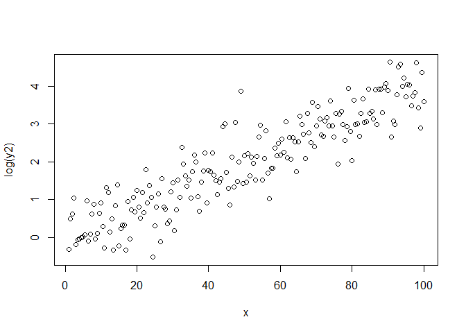<!-- -->


```r
histogram(y2)
plotDist("lnorm", 
         meanlog = mean(log(y2), na.rm = TRUE),
         sdlog = sd(log(y2), na.rm = TRUE), 
         add = TRUE)
```

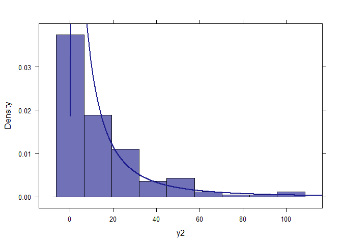<!-- -->

## MODELO


```r
fit2 <- lm(log(y2) ~ x)
s2 <- summary(fit2)
s2
```

```
## 
## Call:
## lm(formula = log(y2) ~ x)
## 
## Residuals:
##     Min      1Q  Median      3Q     Max 
## -1.4740 -0.3438 -0.0224  0.3471  1.9256 
## 
## Coefficients:
##              Estimate Std. Error t value Pr(>|t|)    
## (Intercept) -0.039644   0.077034  -0.515    0.607    
## x            0.040391   0.001326  30.462   <2e-16 ***
## ---
## Signif. codes:  0 '***' 0.001 '**' 0.01 '*' 0.05 '.' 0.1 ' ' 1
## 
## Residual standard error: 0.5373 on 197 degrees of freedom
## Multiple R-squared:  0.8249,	Adjusted R-squared:  0.824 
## F-statistic: 927.9 on 1 and 197 DF,  p-value: < 2.2e-16
```

# EXEMPLO 4

Mantido mesmo vetor x criado anteriormente.

## GERAÇÃO DE DADOS RANDÔMICOS


```r
y3 <- exp(x/25 + rnorm(199, sd = .75)) 
```

## GRÁFICOS


```r
plot(log(y3) ~ x)
```

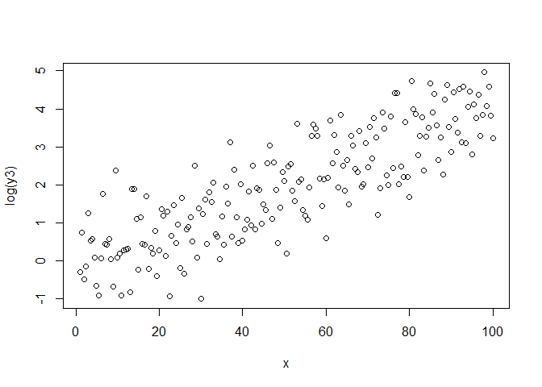<!-- -->


```r
histogram(y3)
plotDist("lnorm", 
         meanlog = mean(log(y3), na.rm = TRUE),
         sdlog = sd(log(y3), na.rm = TRUE), 
         add = TRUE)
```

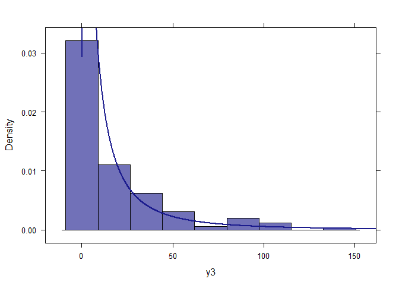<!-- -->

## MODELO


```r
fit3 <- lm(log(y3) ~ x)
s3 <- summary(fit3)
s3
```

```
## 
## Call:
## lm(formula = log(y3) ~ x)
## 
## Residuals:
##      Min       1Q   Median       3Q      Max 
## -2.09563 -0.64150 -0.03851  0.59729  2.15902 
## 
## Coefficients:
##              Estimate Std. Error t value Pr(>|t|)    
## (Intercept) -0.172145   0.115687  -1.488    0.138    
## x            0.042098   0.001991  21.141   <2e-16 ***
## ---
## Signif. codes:  0 '***' 0.001 '**' 0.01 '*' 0.05 '.' 0.1 ' ' 1
## 
## Residual standard error: 0.8068 on 197 degrees of freedom
## Multiple R-squared:  0.6941,	Adjusted R-squared:  0.6925 
## F-statistic:   447 on 1 and 197 DF,  p-value: < 2.2e-16
```

# EXEMPLO 5

Mantido mesmo vetor x criado anteriormente.

## GERAÇÃO DE DADOS RANDÔMICOS


```r
y4 <- exp(x/25 + rnorm(199, sd = 1)) 
```

## GRÁFICOS


```r
plot(log(y4) ~ x)
```

<!-- -->


```r
histogram(y4)
plotDist("lnorm", 
         meanlog = mean(log(y4), na.rm = TRUE),
         sdlog = sd(log(y4), na.rm = TRUE), 
         add = TRUE)
```

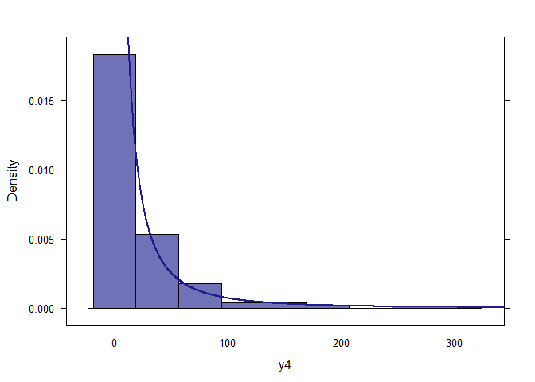<!-- -->

## MODELO


```r
fit4 <- lm(log(y4) ~ x)
s4 <- summary(fit4)
s4
```

```
## 
## Call:
## lm(formula = log(y4) ~ x)
## 
## Residuals:
##      Min       1Q   Median       3Q      Max 
## -3.07159 -0.71233  0.07082  0.67517  3.08445 
## 
## Coefficients:
##              Estimate Std. Error t value Pr(>|t|)    
## (Intercept) -0.066296   0.155891  -0.425    0.671    
## x            0.041566   0.002683  15.491   <2e-16 ***
## ---
## Signif. codes:  0 '***' 0.001 '**' 0.01 '*' 0.05 '.' 0.1 ' ' 1
## 
## Residual standard error: 1.087 on 197 degrees of freedom
## Multiple R-squared:  0.5492,	Adjusted R-squared:  0.5469 
## F-statistic:   240 on 1 and 197 DF,  p-value: < 2.2e-16
```

# ESTIMATIVAS

## Usando o primeiro modelo

a. Moda


```r
p <- predict(fit, newdata = data.frame(x = 50))
p_moda <- exp(p - s$sigma^2)
p_moda
```

```
##        1 
## 7.353577
```

b. Mediana


```r
p_mediana <- exp(p)
p_mediana
```

```
##        1 
## 7.417663
```

c. Média


```r
p_media <- exp(p + s$sigma^2/2)
p_media
```

```
##        1 
## 7.449915
```

## Usando o segundo modelo

a. Moda


```r
p1 <- predict(fit1, newdata = data.frame(x = 50))
p1_moda <- exp(p1 - s1$sigma^2)
p1_moda
```

```
##        1 
## 6.996403
```

b. Mediana


```r
p1_mediana <- exp(p1)
p1_mediana
```

```
##        1 
## 7.459949
```

c. Média


```r
p1_media <- exp(p1 + s1$sigma^2/2)
p1_media
```

```
##        1 
## 7.703116
```

## Usando o terceiro modelo

a. Moda


```r
p2 <- predict(fit2, newdata = data.frame(x = 50))
p2_moda <- exp(p2 - s2$sigma^2)
p2_moda
```

```
##        1 
## 5.426298
```

b. Mediana


```r
p2_mediana <- exp(p2)
p2_mediana
```

```
##        1 
## 7.242041
```

c. Média


```r
p2_media <- exp(p2 + s2$sigma^2/2)
p2_media
```

```
##       1 
## 8.36642
```

## Usando o quarto modelo

a. Moda


```r
p3 <- predict(fit3, newdata = data.frame(x = 50))
p3_moda <- exp(p3 - s3$sigma^2)
p3_moda
```

```
##        1 
## 3.603033
```

b. Mediana


```r
p3_mediana <- exp(p3)
p3_mediana
```

```
##        1 
## 6.908516
```

c. Média


```r
p3_media <- exp(p3 + s3$sigma^2/2)
p3_media
```

```
##        1 
## 9.566278
```
## Usando o quinto modelo

a. Moda


```r
p4 <- predict(fit4, newdata = data.frame(x = 50))
p4_moda <- exp(p4 - s4$sigma^2)
p4_moda
```

```
##        1 
## 2.293168
```

b. Mediana


```r
p4_mediana <- exp(p4)
p4_mediana
```

```
##       1 
## 7.47829
```

c. Média


```r
p4_media <- exp(p4 + s4$sigma^2/2)
p4_media
```

```
##        1 
## 13.50472
```

# VISUALIZAÇÃO GRÁFICA


```r
df <- data.frame(sd = c(0.1, 0.25, 0.5, 0.75, 1),
                 moda = c(p_moda, p1_moda, p2_moda, p3_moda, p4_moda),
                 mediana = c(p_mediana, p1_mediana, p2_mediana, p3_mediana, p4_mediana),
                 media = c(p_media, p1_media, p2_media, p3_media, p4_media))
df <- melt(df, id = "sd")
```


```r
ggplot(df, aes(x = sd, y = value, color = variable)) + 
  geom_point() + geom_line()
```

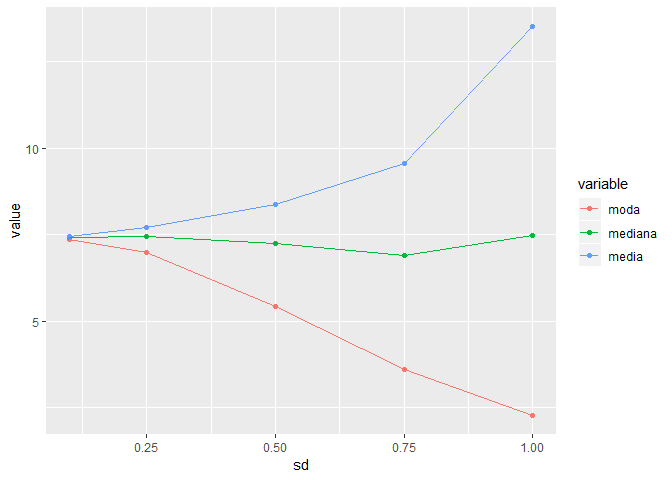<!-- -->

# VALIDAÇÃO CRUZADA

## Modelo 1


```r
id <- sample(1:199, 139)
y_train <- y[id]
y_test <-  y[-id]
x_train <- x[id]
fit <- lm(log(y_train) ~ x_train)
s <- summary(fit)
p <- predict(fit, newdata = data.frame(x_train = x[-id]))
p_moda <- exp(p - s$sigma^2)
p_mediana <- exp(p)
p_media <- exp(p + s$sigma^2/2)
(rmse_moda <- sqrt(mean((p_moda - y_test)^2)))
```

```
## [1] 1.957474
```

```r
(rmse_mediana <- sqrt(mean((p_mediana - y_test)^2)))
```

```
## [1] 1.891117
```

```r
(rmse_media <- sqrt(mean((p_media - y_test)^2)))
```

```
## [1] 1.863776
```

## Modelo 2


```r
id <- sample(1:199, 139)
y1_train <- y1[id]
y1_test <-  y1[-id]
x_train <- x[id]
fit1 <- lm(log(y1_train) ~ x_train)
s1 <- summary(fit1)
p1 <- predict(fit1, newdata = data.frame(x_train = x[-id]))
p1_moda <- exp(p1 - s1$sigma^2)
p1_mediana <- exp(p1)
p1_media <- exp(p1 + s1$sigma^2/2)
(rmse1_moda <- sqrt(mean((p1_moda - y1_test)^2)))
```

```
## [1] 5.480126
```

```r
(rmse1_mediana <- sqrt(mean((p1_mediana - y1_test)^2)))
```

```
## [1] 5.111089
```

```r
(rmse1_media <- sqrt(mean((p1_media - y1_test)^2)))
```

```
## [1] 5.080717
```

## Modelo 3


```r
id <- sample(1:199, 139)
y2_train <- y2[id]
y2_test <-  y2[-id]
x_train <- x[id]
fit2 <- lm(log(y2_train) ~ x_train)
s2 <- summary(fit2)
p2 <- predict(fit2, newdata = data.frame(x_train = x[-id]))
p2_moda <- exp(p2 - s2$sigma^2)
p2_mediana <- exp(p2)
p2_media <- exp(p2 + s2$sigma^2/2)
(rmse2_moda <- sqrt(mean((p2_moda - y2_test)^2)))
```

```
## [1] 18.19711
```

```r
(rmse2_mediana <- sqrt(mean((p2_mediana - y2_test)^2)))
```

```
## [1] 15.21072
```

```r
(rmse2_media <- sqrt(mean((p2_media - y2_test)^2)))
```

```
## [1] 13.83019
```

## Modelo 4


```r
id <- sample(1:199, 139)
y3_train <- y3[id]
y3_test <-  y3[-id]
x_train <- x[id]
fit3 <- lm(log(y3_train) ~ x_train)
s3 <- summary(fit3)
p <- predict(fit3, newdata = data.frame(x_train = x[-id]))
p3_moda <- exp(p3 - s3$sigma^2)
p3_mediana <- exp(p3)
p3_media <- exp(p3 + s3$sigma^2/2)
(rmse3_moda <- sqrt(mean((p3_moda - y3_test)^2)))
```

```
## [1] 25.8767
```

```r
(rmse3_mediana <- sqrt(mean((p3_mediana - y3_test)^2)))
```

```
## [1] 24.55966
```

```r
(rmse3_media <- sqrt(mean((p3_media - y3_test)^2)))
```

```
## [1] 23.77651
```

## Modelo 5


```r
id <- sample(1:199, 139)
y4_train <- y4[id]
y4_test <-  y4[-id]
x_train <- x[id]
fit4 <- lm(log(y4_train) ~ x_train)
s4 <- summary(fit4)
p <- predict(fit4, newdata = data.frame(x_train = x[-id]))
p4_moda <- exp(p4 - s4$sigma^2)
p4_mediana <- exp(p4)
p4_media <- exp(p4 + s4$sigma^2/2)
(rmse4_moda <- sqrt(mean((p4_moda - y4_test)^2)))
```

```
## [1] 64.86965
```

```r
(rmse4_mediana <- sqrt(mean((p4_mediana - y4_test)^2)))
```

```
## [1] 63.03455
```

```r
(rmse4_media <- sqrt(mean((p4_media - y4_test)^2)))
```

```
## [1] 61.47886
```

# VISUALIZAÇÂO VALIDAÇÃO CRUZADA


```r
df <- data.frame(sd = c(0.1, 0.25, 0.5, 0.75, 1),
                 RMSE_moda = c(rmse_moda, rmse1_moda, rmse2_moda, rmse3_moda, 
                               rmse4_moda),
                 RMSE_mediana = c(rmse_mediana, rmse1_mediana, rmse2_mediana, 
                                  rmse3_mediana, rmse4_mediana),
                 RMSE_media = c(rmse_media, rmse1_media, rmse2_media, 
                                rmse3_media, rmse4_media))
df <- melt(df, id = "sd")
```


```r
ggplot(df, aes(x = sd, y = value, color = variable)) + 
  geom_point() + geom_line()
```

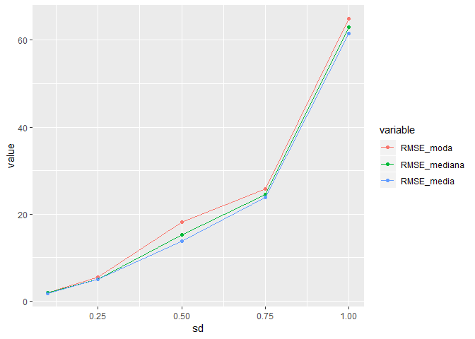<!-- -->

# SIMULAÇÕES DE MONTE CARLO


```r
set.seed(1)
x <- seq(1, 100, 0.5)
sd <- seq(0.1, 3.5, .1)
n <- 500
rmse <- NULL
for (i in seq_along(sd)) {
  moda <- NULL
  mediana <- NULL
  media <- NULL
  for (j in 1:n){
    y <- exp(x/25 + rnorm(199, sd = sd[[i]])) 
    id <- sample(1:199, 139)
    y_train <- y[id]
    y_test <-  y[-id]
    x_train <- x[id]
    fit <- lm(log(y_train) ~ x_train)
    s <- summary(fit)
    p <- predict(fit, newdata = data.frame(x_train = x[-id]))
    p_moda <- exp(p - s$sigma^2)
    p_mediana <- exp(p)
    p_media <- exp(p + s$sigma^2/2)
    moda[[j]] <- sqrt(mean((p_moda - y_test)^2))
    mediana[[j]] <- sqrt(mean((p_mediana - y_test)^2))
    media[[j]] <- sqrt(mean((p_media - y_test)^2))  
  }
  rmse[[i]] <- data.frame(sd = sd[[i]], moda, mediana, media)
}
rmse <- do.call(rbind, rmse)
rmse %<>% 
  rowwise() %>% 
  mutate(Min = which.min(c(moda, mediana, media)))
```


```r
medias <- rmse %>%
  group_by(sd) %>%
  summarise(Moda = mean(moda), 
            Mediana = mean(mediana), 
            Media = mean(media))
```

```
## Warning: Grouping rowwise data frame strips rowwise nature
```

```r
n <- rmse %>%
  group_by(sd, Min) %>%
  summarise(n())
```

```
## Warning: Grouping rowwise data frame strips rowwise nature
```


```r
medias <- melt(medias, id = "sd")
ggplot(medias, aes(x = sd, y = value, color = variable)) + 
  geom_point() + 
  geom_line()
```

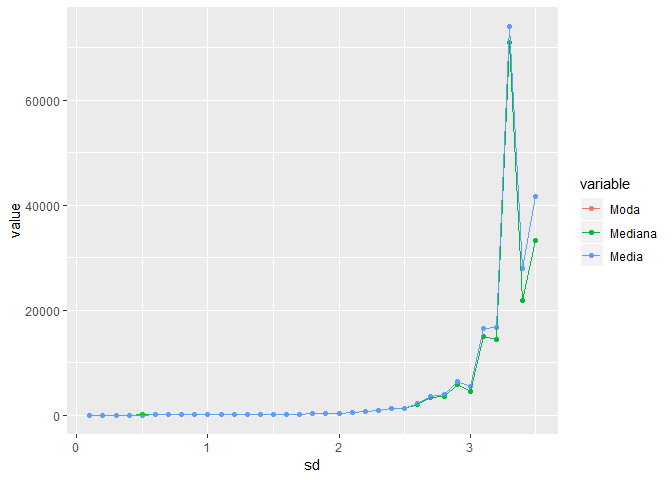<!-- -->

```r
ggplot(n, aes(x = sd, y = `n()`, 
              color = factor(Min, 
                             levels = c(1, 2, 3), 
                             labels = c("moda", "mediana", "media")))) + 
  geom_point() + 
  geom_line() + 
  guides(color=guide_legend(title="Estimativa"))
```

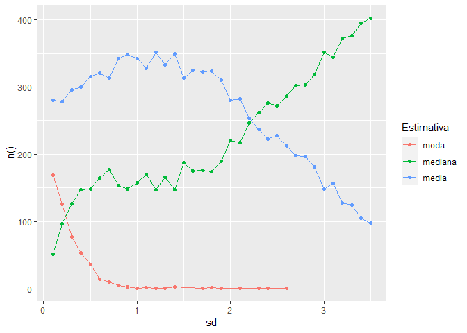<!-- -->


# REGRESSÃO À MEDIANA

# VALIDAÇÃO CRUZADA

## Modelo 1


```r
fit <- rq(log(y_train) ~ x_train)
s <- summary(fit)
p <- predict(fit, newdata = data.frame(x_train = x[-id]))
p_mediana <- exp(p)
(mape <- mean(abs(p_mediana - y_test)))
```

```
## [1] 474.8637
```

## Modelo 2


```r
fit1 <- rq(log(y1_train) ~ x_train)
s1 <- summary(fit1)
p1 <- predict(fit1, newdata = data.frame(x_train = x[-id]))
p1_mediana <- exp(p1)
(mape1 <- mean(abs(p1_mediana - y1_test)))
```

```
## [1] 12.69458
```

## Modelo 3


```r
fit2 <- rq(log(y2_train) ~ x_train)
s2 <- summary(fit2)
p2 <- predict(fit2, newdata = data.frame(x_train = x[-id]))
p2_mediana <- exp(p2)
(mape2 <- mean(abs(p2_mediana - y2_test)))
```

```
## [1] 14.57397
```

## Modelo 4


```r
fit3 <- rq(log(y3_train) ~ x_train)
s3 <- summary(fit3)
p <- predict(fit3, newdata = data.frame(x_train = x[-id]))
p3_mediana <- exp(p3)
(mape3 <- mean(abs(p3_mediana - y3_test)))
```

```
## [1] 13.29267
```

## Modelo 5


```r
fit4 <- rq(log(y4_train) ~ x_train)
s4 <- summary(fit4)
p <- predict(fit4, newdata = data.frame(x_train = x[-id]))
p4_mediana <- exp(p4)
(mape4 <- mean(abs(p4_mediana - y4_test)))
```

```
## [1] 28.11301
```


```r
df <- data.frame(sd = c(0.1, 0.25, 0.5, 0.75, 1),
                 MAPE = c(mape, mape1, mape2, mape3, mape4))
df <- melt(df, id = "sd")
```


```r
ggplot(df, aes(x = sd, y = value, color = variable)) + 
  geom_point() + geom_line()
```

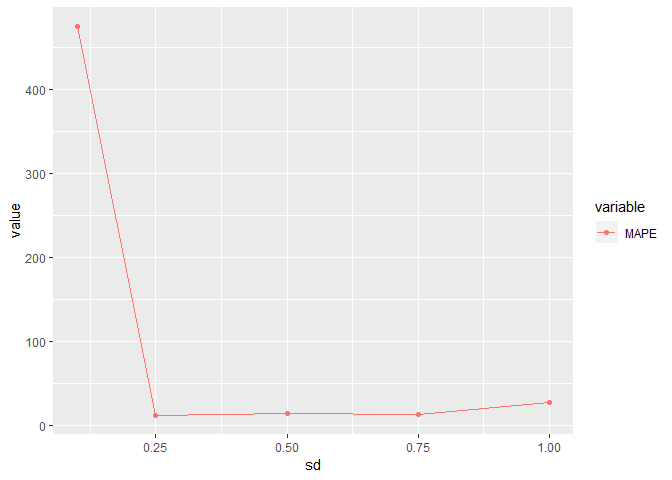<!-- -->

# REFERÊNCIAS
