# INTRODUÇÃO

Segundo Limpert [@limpert, 346], distribuições lognormais de diversas ciências tem, em geral, valores de $s^*$ variando de 1,1 a 33 (na escala natural, entre 0,095 e 3,497), sendo que o mais comum é que estes valores estejam entre 1,4 e 3 (0,336 $\leq s \leq$ 1,099). 

Na Engenharia de Avaliações, temos: 


* Hochheim [@hochheim, 21]: $s^* =$ 1,851.

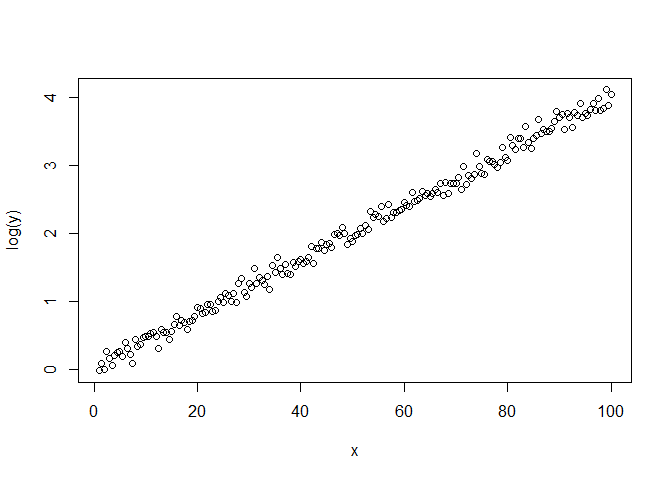<!-- -->


# EXEMPLOS DE APLICAÇÃO

## EXEMPLO 1

### GERAÇÃO DE DADOS LOGNORMAIS COM $s^* = 1,1$


### GRÁFICOS


## EXEMPLO 2

Mantido mesmo vetor x criado anteriormente.

### GERAÇÃO DE DADOS LOGNORMAIS COM $s^* = 1,25$


### GRÁFICOS


## EXEMPLO 3

Mantido mesmo vetor x criado anteriormente.

### GERAÇÃO DE DADOS LOGNORMAIS COM $s^* = 1,5$


### GRÁFICOS


## EXEMPLO 4

Mantido mesmo vetor x criado anteriormente.

### GERAÇÃO DE DADOS LOGNORMAIS COM $s^* = 2$


### GRÁFICOS


## EXEMPLO 5

Mantido mesmo vetor x criado anteriormente.

### GERAÇÃO DE DADOS LOGNORMAIS COM $s^* = 3$


### GRÁFICOS


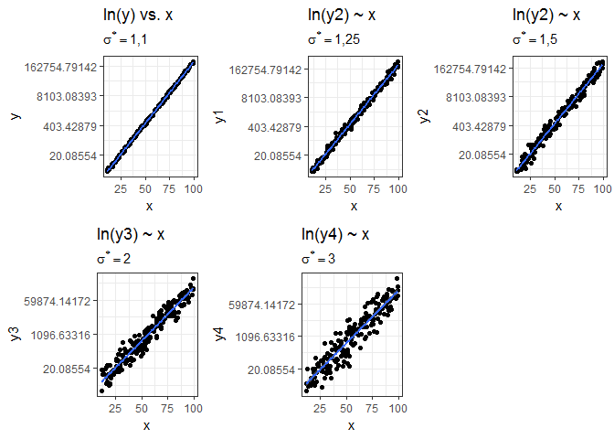<!-- -->

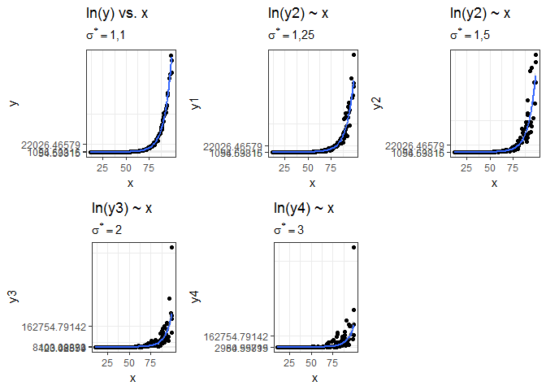<!-- -->


## MODELOS


<table style="text-align:center"><tr><td colspan="6" style="border-bottom: 1px solid black"></td></tr><tr><td style="text-align:left"></td><td colspan="5"><em>Dependent variable:</em></td></tr>
<tr><td></td><td colspan="5" style="border-bottom: 1px solid black"></td></tr>
<tr><td style="text-align:left"></td><td>log(y)</td><td>log(y1)</td><td>log(y2)</td><td>log(y3)</td><td>log(y4)</td></tr>
<tr><td style="text-align:left"></td><td>(1)</td><td>(2)</td><td>(3)</td><td>(4)</td><td>(5)</td></tr>
<tr><td colspan="6" style="border-bottom: 1px solid black"></td></tr><tr><td style="text-align:left">x</td><td>0.125<sup>***</sup></td><td>0.125<sup>***</sup></td><td>0.126<sup>***</sup></td><td>0.126<sup>***</sup></td><td>0.130<sup>***</sup></td></tr>
<tr><td style="text-align:left"></td><td>(0.0003)</td><td>(0.001)</td><td>(0.001)</td><td>(0.002)</td><td>(0.003)</td></tr>
<tr><td style="text-align:left"></td><td></td><td></td><td></td><td></td><td></td></tr>
<tr><td style="text-align:left">Constant</td><td>0.001</td><td>0.005</td><td>-0.083</td><td>-0.031</td><td>-0.304</td></tr>
<tr><td style="text-align:left"></td><td>(0.017)</td><td>(0.044)</td><td>(0.075)</td><td>(0.136)</td><td>(0.205)</td></tr>
<tr><td style="text-align:left"></td><td></td><td></td><td></td><td></td><td></td></tr>
<tr><td colspan="6" style="border-bottom: 1px solid black"></td></tr><tr><td style="text-align:left">Observations</td><td>200</td><td>200</td><td>200</td><td>200</td><td>200</td></tr>
<tr><td style="text-align:left">R<sup>2</sup></td><td>0.999</td><td>0.994</td><td>0.982</td><td>0.942</td><td>0.885</td></tr>
<tr><td style="text-align:left">Adjusted R<sup>2</sup></td><td>0.999</td><td>0.994</td><td>0.982</td><td>0.942</td><td>0.885</td></tr>
<tr><td style="text-align:left">Residual Std. Error (df = 198)</td><td>0.095</td><td>0.242</td><td>0.417</td><td>0.757</td><td>1.138</td></tr>
<tr><td style="text-align:left">F Statistic (df = 1; 198)</td><td>201,667.600<sup>***</sup></td><td>31,052.960<sup>***</sup></td><td>10,602.630<sup>***</sup></td><td>3,209.406<sup>***</sup></td><td>1,530.324<sup>***</sup></td></tr>
<tr><td colspan="6" style="border-bottom: 1px solid black"></td></tr><tr><td style="text-align:left"><em>Note:</em></td><td colspan="5" style="text-align:right"><sup>*</sup>p<0.1; <sup>**</sup>p<0.05; <sup>***</sup>p<0.01</td></tr>
</table>


## ESTIMATIVAS

### Usando o primeiro modelo

a. Moda


```
##        1 
## 513.2197
```

b. Mediana


```
##        1 
## 517.8783
```

c. Média


```
##        1 
## 520.2235
```

### Usando o segundo modelo

a. Moda


```
##        1 
## 489.3929
```

b. Mediana


```
##        1 
## 518.9507
```

c. Média


```
##        1 
## 534.3924
```

### Usando o terceiro modelo

a. Moda


```
##        1 
## 412.8435
```

b. Mediana


```
##        1 
## 491.0885
```

c. Média


```
##        1 
## 535.6078
```

### Usando o quarto modelo

a. Moda


```
##        1 
## 291.7597
```

b. Mediana


```
##        1 
## 517.7662
```

c. Média


```
##       1 
## 689.744
```

### Usando o quinto modelo

a. Moda


```
##        1 
## 136.5677
```

b. Mediana


```
##        1 
## 498.4588
```

c. Média


```
##        1 
## 952.2914
```

## VISUALIZAÇÃO GRÁFICA


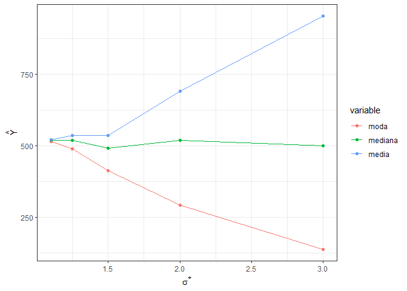<!-- -->

## VALIDAÇÃO CRUZADA

### Modelo 1


```
## [1] 6428.937
```

```
## [1] 6495.172
```

```
## [1] 6543.496
```

### Modelo 2


```
## [1] 14513.19
```

```
## [1] 13006
```

```
## [1] 12346.92
```

### Modelo 3


```
## [1] 10783.74
```

```
## [1] 9474.11
```

```
## [1] 9624.543
```

### Modelo 4


```
## [1] 76163.18
```

```
## [1] 76067.27
```

```
## [1] 75995.76
```

### Modelo 5


```
## [1] 109752.8
```

```
## [1] 109624.5
```

```
## [1] 109452.1
```

### VISUALIZAÇÂO VALIDAÇÃO CRUZADA


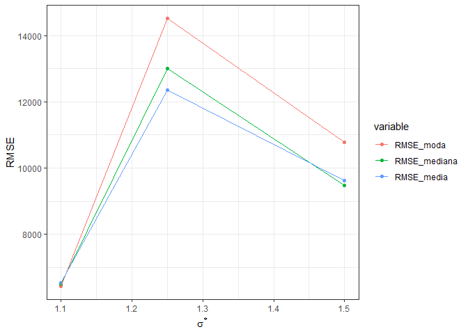<!-- -->

# REGRESSÃO À MEDIANA

# VALIDAÇÃO CRUZADA

## Modelo 1


```
## [1] 26382.03
```

## Modelo 2


```
## [1] 18372.24
```

## Modelo 3


```
## [1] 13173.89
```

## Modelo 4


```
## [1] 33506.99
```

## Modelo 5


```
## [1] 37559.6
```


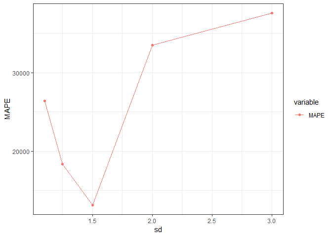<!-- -->

# SIMULAÇÕES DE MONTE CARLO


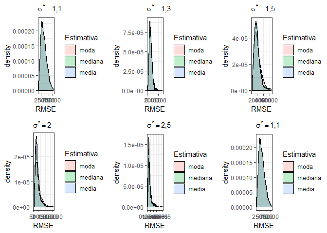<!-- -->


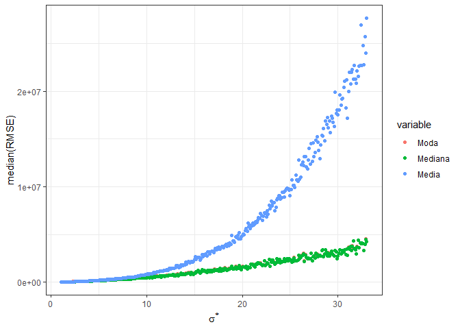<!-- -->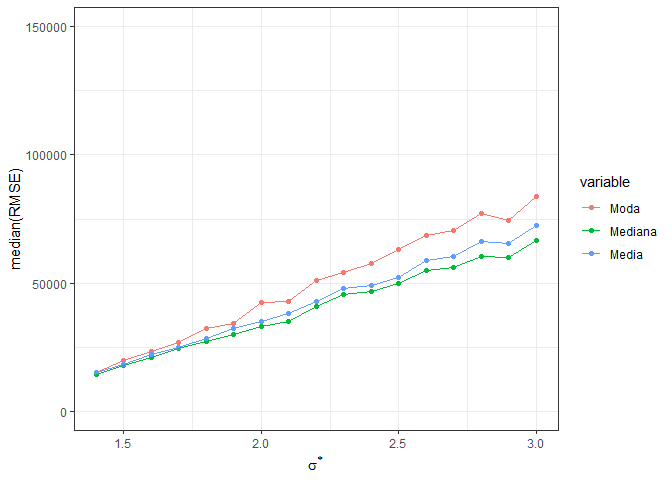<!-- -->

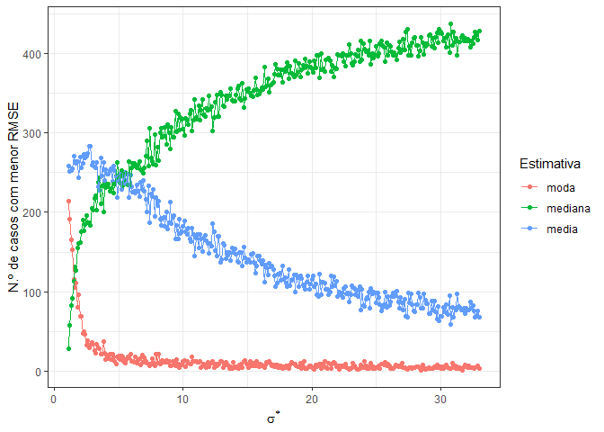<!-- -->

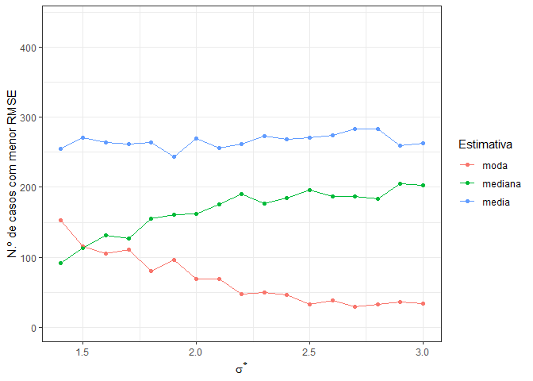<!-- -->

# REFERÊNCIAS
