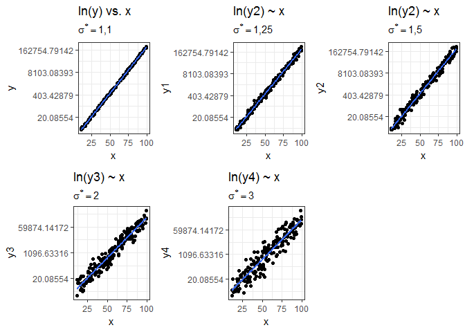
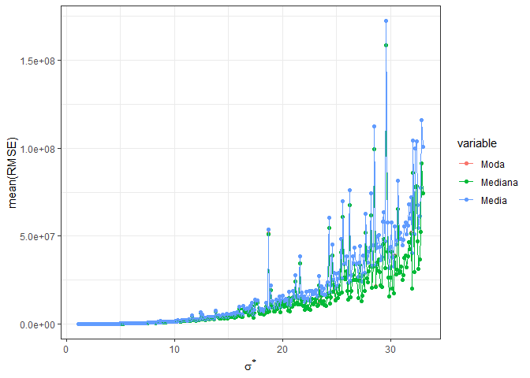
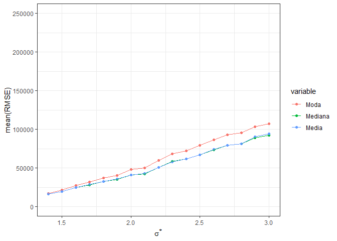
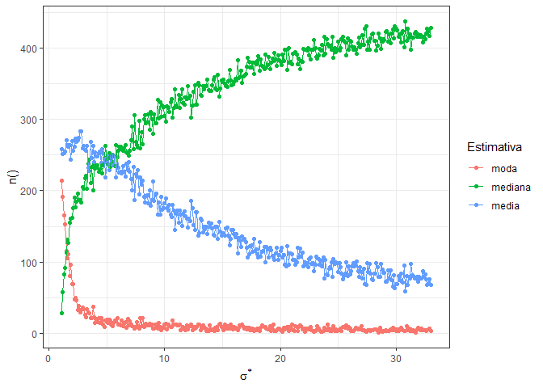
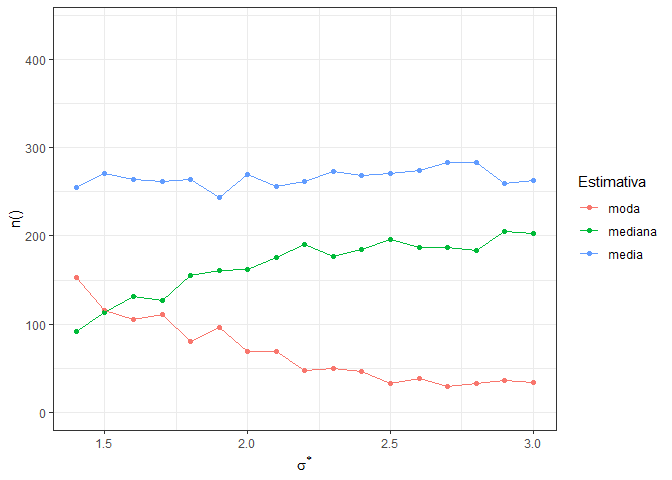
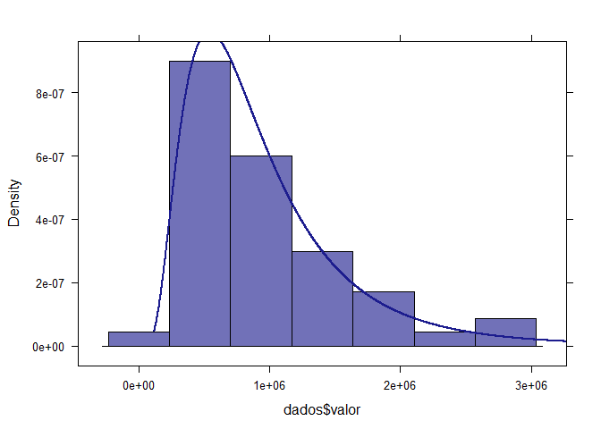

```{r setup, include=FALSE}
options(htmltools.dir.version = FALSE)
library(appraiseR)
library(quantreg)
library(texreg)
library(latex2exp)
library(leaflet)
library(sp)
library(ggplot2)
#library(emo)
library(reshape2)
theme_set(theme_bw())
```

background-image: url(https://raw.githubusercontent.com/lfpdroubi/dist_lognormal/master/images/densidade_medidas-1.png)

---
class: inverse, center, middle

# Regressão Linear

## Revisão
---

### Regressão linear

#### Origem

> The word “regression” is an allusion to the famous comment of Sir Francis Galton in the late 1800s regarding “regression toward the mean.” This referred to the fact that tall parents tend to have children who are less tall closer to the mean – with a similar statement for short parents. The predictor variable here might be, say, the father’s height F, with the response variable being, say, the son’s height S. Galton was saying that E(S|F) < F.

--

#### Definição precisa

$$m_{Y ;X}(t) = \mathbb{E}(Y |X = t)$$
--

#### Notação

$$\mu(t) = \beta_0 + \beta_1t_1 + ... + \beta_pt_p$$

$$\epsilon = Y - \mu(X)$$

$$Y = \beta_0 + \beta_1t_1+ ... +\beta_pt_p+\epsilon$$

???

MATLOFF, N. S. From Algorithms to Z-Scores: Probabilistic and statistical modeling in computer science. Davis, California: Orange Grove Books, 2009.

p. 386

[ProbStatBook](http://heather.cs.ucdavis.edu/~matloff/132/PLN/probstatbook/ProbStatBook.pdf)


---
### Regressão linear

#### Notação

$$\mu(t) = \beta_0 + \beta_1t_1 + ... + \beta_pt_p$$

$$\epsilon = Y - \mu(X)$$

$$Y = \beta_0 + \beta_1t_1+ ... +\beta_pt_p+\epsilon$$
--

#### O problema da retransformação
--

* Sem transformação, temos:

$$\mathbb{E}[Y|X] = \mathbb{E}[\alpha + X\beta] + \mathbb{E}[\epsilon] = \alpha + X\beta$$
--

* Com transformação:

$$\ln(Y) = \alpha + X\beta + \epsilon \Leftrightarrow$$
$$Y = \exp(\alpha + X\beta)\exp(\epsilon) \Leftrightarrow$$
$$\mathbb{E}[Y|X] = \mathbb{E}[\exp(\alpha + X\beta)]\mathbb{E}[\exp(\epsilon)|X] \Leftrightarrow$$
$$\mathbb{E}[Y|X] = \exp(\alpha + X\beta)\mathbb{E}[\exp(\epsilon)|X]$$
---
### Regressão linear

#### O problema da retransformação

##### A desigualdade de Jensen

Se $\varphi(X)$ é convexa:

$\varphi \left(\mathbb{E} [X]\right)\leq \mathbb{E} \left[\varphi (X)\right].$

--

* $f(x) = x^2$ é convexa, pois $f''(x) = 2 > 0 \qquad \forall x \in \mathbb{R}$

--

* $f(x) = \textrm{e}^x$ é convexa, pois $f''(x) = \textrm{e}^x > 0 \qquad \forall x \in \mathbb{R}$

--

* $\mathbb{E}[\exp(\epsilon)|X] > \exp(\mathbb{E}[\epsilon])$

--

* $\mathbb{E}[\exp(\epsilon)|X] > 1$

--

Isto explica o fator multiplicativo "introduzido" na equação de regressão.

---
### Regressão Linear

#### $\mu(t)$ minimiza MSPE

--
##### Prova

--
1. c constante.

$$\mathbb{E}[(W - c)^2] = E[W^2-2cW+c^2] = E(W^2) - 2cE[W]+c^2$$

$$\frac{d \mathbb{E}[(W - c)^2]}{dc} = 0\rightarrow 2E[W] + 2c = 0$$

$$\Leftrightarrow c = E[W]$$

--
2. $c = f(X)$

$$MSPE = \mathbb{E}[(Y-f(X))^2] = \mathbb{E}[\mathbb{E}[(Y-f(X))^2|X]$$

--
A função $f(X)$ que minimiza $\mathbb{E}[(Y-f(X))^2]$, por analogia ao item anterior, é a função $E(Y|X)$, ou seja, a média, *i.e.* $\mu(t)$. Então, a expectativa total $\mathbb{E}[\mathbb{E}[(Y-f(X))^2|X]]$, também é minimizada com este valor.


---
class: inverse, center, middle

# Distribuição Lognormal

## Definição e propriedades

---

### Distribuição Lognormal

#### Definição

Uma variável aleatória $X$ tem distribuição lognormal se seu logaritmo $Y = log(X)$ tem  distribuição normal.

$$f(x;\mu, \sigma) = \frac{1}{x\sigma\sqrt{2\pi}} \exp \left [ -\frac{(\ln(x) - \mu)^2}{2\sigma^2} \right ] $$

em que:

- $\mu$ é a mediana
- $\sigma > 0$ é o desvio-padrão

---

### Distribuição Lognormal

#### Estimação dos parâmetros da distribuição

$$\bar{x}^* = \exp \left ( \frac{1}{n} \sum_{i=1}^{n} \ln(x_i) \right ) = \left ( \prod_{i=1}^{n} x_i \right )^{\frac{1}{n}}$$
--

$$s^* = \exp \left \{ \left [ \frac{1}{n-1} \sum_{i=1}^n \left [  \ln \left ( \frac{x_i}{\bar{x}^*}  \right ) \right ] ^2  \right ] ^\frac{1}{2} \right \}$$
--

#### Valores comuns de $s^*$

$$1,4 \leq s^* \leq 3$$
--

#### Valores extremos de $s^*$

$$1,1 \leq s^* \leq 33$$

---

### Distribuição Lognormal

#### Efeito de $\sigma$ na forma da distribuição

```{r logs, echo = FALSE, dev='svg', fig.height=4}
x <- seq(0, 3, 0.01)
sigma <- c(2, 1.5, 1, .5, .25)
y <- lapply(sigma, dlnorm, x = x, meanlog = log(1))
data <- data.frame(x, y[[1]], y[[2]], y[[3]], y[[4]], y[[5]])
colnames(data) <- c("x", "y1", "y2", "y3", "y4", "y5")
data <- melt(data, id = 1)
ggplot(data, aes(x = x, y = value, 
                 color = factor(variable, labels = as.character(sigma)))) +
  geom_line() +
  scale_y_continuous(limits = c(0, max(data$value)), expand = c(0, 0)) + 
  scale_x_continuous(limits = c(0, max(data$x)), expand = c(0, 0)) +
  labs(title = "Distribuições lognormais",
       subtitle = TeX("$\\mu = log(1) = 0$"),
       color = TeX("$\\sigma$"))
```

---
### Distribuição Lognormal

#### Estimativas

--

- O valor esperado (**média**) de $X$ é:

$$E(X) = E(exp(Y)) = exp(E(Y) + 0,5\sigma^2)$$
$$ E(x) = exp(\mu + 0,5\sigma^2)$$
--

- O valor da **mediana** é:

$$\nu=exp(\mu)$$
--

- O valor da **moda** é:

$$M_o=exp(\mu-\sigma^2)$$

--

Qual delas é a "melhor"?

---

### Distribuição Lognormal


---
class: inverse, center, middle

# SIMULAÇÕES

---

### Simulações



---
### Simulações

<table style="text-align:center"><caption><strong>Comparação dos diversos modelos gerados, com diferentes erro-padrão</strong></caption>
<tr><td colspan="6" style="border-bottom: 1px solid black"></td></tr><tr><td style="text-align:left"></td><td colspan="5"><em>Dependent variable:</em></td></tr>
<tr><td></td><td colspan="5" style="border-bottom: 1px solid black"></td></tr>
<tr><td style="text-align:left"></td><td>log(y)</td><td>log(y1)</td><td>log(y2)</td><td>log(y3)</td><td>log(y4)</td></tr>
<tr><td style="text-align:left"></td><td>(1)</td><td>(2)</td><td>(3)</td><td>(4)</td><td>(5)</td></tr>
<tr><td colspan="6" style="border-bottom: 1px solid black"></td></tr><tr><td style="text-align:left">x</td><td>0,125<sup>***</sup></td><td>0,125<sup>***</sup></td><td>0,126<sup>***</sup></td><td>0,126<sup>***</sup></td><td>0,130<sup>***</sup></td></tr>
<tr><td style="text-align:left"></td><td>(0,0003)</td><td>(0,001)</td><td>(0,001)</td><td>(0,002)</td><td>(0,003)</td></tr>
<tr><td style="text-align:left"></td><td></td><td></td><td></td><td></td><td></td></tr>
<tr><td style="text-align:left">Constant</td><td>0,001</td><td>0,005</td><td>-0,083</td><td>-0,031</td><td>-0,304</td></tr>
<tr><td style="text-align:left"></td><td>(0,017)</td><td>(0,044)</td><td>(0,075)</td><td>(0,136)</td><td>(0,205)</td></tr>
<tr><td style="text-align:left"></td><td></td><td></td><td></td><td></td><td></td></tr>
<tr><td colspan="6" style="border-bottom: 1px solid black"></td></tr><tr><td style="text-align:left">Observations</td><td>200</td><td>200</td><td>200</td><td>200</td><td>200</td></tr>
<tr><td style="text-align:left">R<sup>2</sup></td><td>0,999</td><td>0,994</td><td>0,982</td><td>0,942</td><td>0,885</td></tr>
<tr><td style="text-align:left">Adjusted R<sup>2</sup></td><td>0,999</td><td>0,994</td><td>0,982</td><td>0,942</td><td>0,885</td></tr>
<tr><td style="text-align:left">Residual Std. Error (df = 198)</td><td>0,095</td><td>0,242</td><td>0,417</td><td>0,757</td><td>1,138</td></tr>
<tr><td colspan="6" style="border-bottom: 1px solid black"></td></tr><tr><td style="text-align:left"><em>Note:</em></td><td colspan="5" style="text-align:right"><sup>*</sup>p<0,1; <sup>**</sup>p<0,05; <sup>***</sup>p<0,01</td></tr>
</table>

---
### Simulações

#### $\hat{Y}$ vs. $\sigma^*$


---
### Simulações

#### $\overline{RMSE}(\sigma^*)$


---

### Simulações

#### $\overline{RMSE}(\sigma^*)$



---

### Simulações



---
### Simulações



---
class: inverse, center, middle
# EXEMPLO

## Com dados reais de mercado

---

### Exemplo

#### Florianópolis - Centro (2015)

```{r, echo = FALSE, out.width='100%', fig.height=6, eval=require('leaflet')}
data(centro_2015)
centro_2015 <- spTransform(centro_2015, CRS("+init=epsg:4326"))
leaflet(centro_2015) %>% 
  addProviderTiles(providers$CartoDB.Positron) %>% 
  addCircleMarkers(color = ~ifelse(padrao == "baixo", "green", 
                                   ifelse(padrao == "medio", "blue", "red")),
                   radius = ~10*as.vector(scale(valor)),
                   popup = as.character(1:50),
                   label = as.character(1:50),
                   fillOpacity = 0.5)
```

---
### Exemplo

#### Histograma da Variável Dependente


---
### Exemplo

#### Estatísticas do Modelo

```{r, echo = FALSE, warning=FALSE}
dados <- centro_2015@data
dados$padrao <- as.numeric(dados$padrao)
fit <- lm(log(valor) ~ area_total + quartos + suites + garagens + 
            log(dist_b_mar) + I(padrao^-1), 
          data = dados, subset = -c(31,39))
s <- summary(fit)
```

```{r, echo = FALSE, results='asis', warning=FALSE}
htmlreg(fit, doctype = FALSE,
        single.row = TRUE, 
        include.bic = TRUE,
        caption.above = TRUE, digits = 3,
        ci.force = TRUE)
```

---
### Exemplo

#### Impacto do erro-padrão da regressão na estimativa

|  Estimativa / Erro-Padrão | 0,136      |0,25       | 0,5         | 0,75       |
|:--------------------------|-----------:|----------:|------------:|-----------:|
| Moda                      | 944.013,56 |903.396,57 |748.942,06   |547.937,72  |
| Dif. em relação à Mediana | -1,84%     | -6,06%    | -22,12%     | -43,02%    |
| Mediana                   | 961.660,64 |961.660,64 |961.660,64   |961.660,64  |
| Média                     | 970.607,51 |992.187,03 |1.089.704,27 |1.273.993,36|
| Dif. em relação à Mediana | +0,93%     | +3,17%    | +13,31%     | +32,48%    |

---
class: inverse, center, middle
# ESTIMADORES

---

## Exemplo

Sejam X e Y duas amostras de alturas de homens (X) e mulheres (Y). Assuma, por simplicidade que $\sigma_X = \sigma_Y = \sigma$ e que a médias das populações sejam iguais a $\mu_X$ e $\mu_Y$.

--

Suponha que, baseado nas amostras disponíveis, se pretenda estimar a altura de um homem qualquer na população.

--

A escolha natural seria: $T_1 = \bar{X}$

--

Porém, se a amostragem for pequena, poderíamos utilizar: $T_2 = \frac{\bar{X} + \bar{Y}}{2}$

--

Embora se saiba que $T_2$ é um estimador viesado (mulheres são, em média, menores), temos:

--

* Viés de $T_1$: $\text{B}(T_1) = 0$
* Viés de $T_2$: $B(T_2) = (0,5\mu_1 + 0,5\mu_2)-\mu_1$
* Variância de $T_1$: $\text{Var}(T_1) = \sigma^2/n$
* Variância de $T_2$: $\text{Var}^(T_2) = \text{Var}(0,5\bar{X} + 0,5\bar{Y}) = 0,5^2 \text{Var}(\bar{X}) + 0,5^2 \text{Var}(\bar{Y}) = \sigma^2/2n$

--

Como $\text{MSE}(\theta) = \text{Var}(\theta) + B^2(\theta)$:

* $\text{MSE}(T_1) = \sigma^2/n + 0^2 = \sigma^2/n$
* $\text{MSE}(T_2) = \sigma^2/2n + \left [ (0,5\mu_1 + 0,5\mu_2)-\mu_1 \right ]^2 = \sigma^2/2n + \left ( \frac{\mu_2 - \mu_1}{2} \right )^2$

---

Como $\text{MSE}(\theta) = \text{Var}(\theta) + B^2(\theta)$:

* $\text{MSE}(T_1) = \sigma^2/n + 0^2 = \sigma^2/n$
* $\text{MSE}(T_2) = \sigma^2/2n + \left [ (0,5\mu_1 + 0,5\mu_2)-\mu_1 \right ]^2 = \sigma^2/2n + \left ( \frac{\mu_2 - \mu_1}{2} \right )^2$

--

Portanto, $T_1$ somente será um melhor estimador que $T_2$ se:

$$\left ( \frac{\mu_2 - \mu_1}{2} \right )^2 > \frac{\sigma^2}{2n}$$
--

Analogamente

--

* $\text{Var}(\nu) = \text{Var}[\exp(W)]$

--

* $\text{B}(\nu) = \nu - \mu  = \frac{\mu}{\exp(\sigma^2/2)} - \mu$

--

* $\text{Var}(\mu) = \text{Var}[\exp(W + \sigma^2/2)] = \text{Var}[\exp(W) .\exp(\sigma^2/2)]$

  + $\text{Var}(\mu) = \exp(\sigma^2)\text{Var}(\nu) \qquad  (\text{Var}(c.U) = c^2 \text{Var}(U))$

--

* $B(\mu) = 0$

--

Então:

--

$\text{MSE}(\nu) = \text{Var}(\nu) + \text{B}^2(\nu) = \text{Var}(\nu) + \left ( \frac{\mu}{\exp(\sigma^2/2)} - \mu \right )^2$

--

$\text{MSE}(\mu) = \text{Var}(\mu) + \text{B}^2(\mu) = \exp(\sigma^2)\text{Var}(\nu)$

---

$\text{MSE}(\nu) = \text{Var}(\nu) + \text{B}^2(\nu) = \text{Var}(\nu) + \left ( \frac{\mu}{\exp(\sigma^2/2)} - \mu \right )^2$

$\text{MSE}(\mu) = \text{Var}(\mu) + \text{B}^2(\mu) = \exp(\sigma^2)\text{Var}(\nu)$

--

Logo, $\mu$ é um estimador melhor que $\nu$ se:

$\text{Var}(\nu) + \left ( \frac{\mu}{\exp(\sigma^2/2)} - \mu \right )^2 > \exp(\sigma^2)\text{Var}(\nu)$

$\text{Var}(\nu) > \frac{\left ( \frac{\mu}{\exp(\sigma^2/2)} - \mu \right )^2}{1-\exp(\sigma^2)}$
